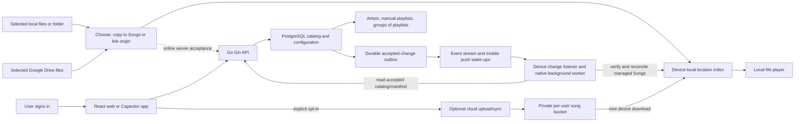

# Song Sleeve implementation plan

**Status:** planning  
**Last updated:** 2026-10-07

## Product direction

Song Sleeve is local-first. Every song, synced or unsynced, has one authoritative track document containing its stable identity, name, optional artist, duration, size, and current audio/source reference. This is a PostgreSQL catalog record, not a separate document database; audio bytes stay in files or object storage. For unsynced tracks, it describes the last file and metadata explicitly accepted by the user, which can become stale if the original file changes externally. External changes never silently rewrite the document. All accepted app edits belong to the account: running devices apply dispatched changes for synced and unsynced songs alike, including minimized installed clients whenever their platform permits background execution; suspended/offline devices catch up when execution/connectivity resumes. The binary is separate from the document, and manual replacement preserves the track identity. Catalog and organization changes require a live authenticated connection and server acceptance; cached browsing and already-local playback work offline. Explicit unsync removes controlled audio copies but preserves the document with no active source until the user selects a local file or deletes the track. For an unsynced track, the active local source is the user’s selected managed copy or linked original location. Once cloud sync is enabled and the upload verifies, an installed desktop/native client keeps the song in its app-managed `Songs` directory and plays from that local file. The bucket is the synchronization source used to populate/update local `Songs`, never the native/desktop playback source. On web only, a synced track is fetched from the bucket one complete song at a time into a transient player resource. Device paths and access grants stay local.

Songs live together in one logical collection and are organized only by optional user-assigned artists, manually populated playlists, and manually populated groups of playlists. A playlist contains only songs; a group contains only playlists. Library type filters are display preferences, not organizational collections. Adding a song to a playlist changes configuration; it never moves the audio into a playlist folder or makes another copy.

## Visual style foundation

Use Graphite for the app background, Charcoal for general-purpose surfaces, Sand Dune as the secondary color, and Blaze Orange as the primary color.

| Token | Color | Initial role |
| --- | --- | --- |
| `color-background` | Graphite `#2D2D2A` | Main app background and broad page canvas |
| `color-surface` | Charcoal `#4C4C47` | General-purpose surfaces such as panels, cards, navigation, and the persistent player bar |
| `color-secondary` | Sand Dune `#E5DCC5` | Secondary emphasis, selected-state accents, and progress/highlight details |
| `color-primary` | Blaze Orange `#F26419` | Primary actions and prominent active controls |

Use white text on Graphite and Charcoal, and near-black ink (`#161615`) on Sand Dune and Orange for readable labels. Approximate WCAG contrast ratios are 13.81:1 for white on Graphite, 8.63:1 for white on Charcoal, 13.26:1 for near-black ink on Sand Dune, and 5.70:1 for near-black ink on Blaze Orange. White text on Blaze Orange is only about 3.18:1; use near-black labels on primary buttons. Sand text on Charcoal is approximately 6.32:1, while Orange text on Charcoal is only about 2.72:1, so use Sand or white for ordinary text links and reserve Orange for primary fills and graphical accents. Do not rely on color alone for selected, playing, sync, or error states; pair it with labels/icons. These are initial color tokens—the typography, spacing, icon family, and motion rules can be defined as the visual system develops.

## Architecture review checklist

Resolve these items in order before treating the design as implementation-ready. Items 1–3 record the agreed playback-source, authoritative-track, account-update, and explicit unsync rules. Item 4 fixes lifetime identity and unconditional content replacement for every explicit source-file submission; duplicate-file detection/reuse is not required. Item 5 now defines per-user/track serialization, device notifications, and playback-safe deferred application; transfer recovery details remain open. Item 6 now requires online server acceptance for edits and disallows offline mutation replay. Item 7 now specifies a device listener and native background synchronization; its feasibility tests will happen during implementation. Item 8 now has approved song limits of 30 minutes AND 128 MiB across every client; browser resource and enforcement tests remain for implementation. Item 9 now defines 30-day sessions, email password recovery, and irreversible hard deletion with later device cleanup. Data-integrity/delivery details and implementation tests for items 7–9 remain open; item 10 is resolved: artists, manually populated playlists, and non-nested groups of playlists are the complete organization model. The complete review and focused research notes are in [the architecture review folder](research/architecture-review/architecture-review.md).

- [x] **Track identity and playback source:** `tracks` holds metadata and a stable ID; one current content-version ID identifies its audio. Unsynced playback uses the selected local copy or linked origin. Synced desktop/native playback always uses that device’s managed `Songs` file; cloud storage only populates/updates local `Songs`. Web is the exception: it fetches one selected synced song from the bucket into a transient Blob and releases it when another song is requested. Device paths never sync to the server.
- [x] **Single authoritative track document:** every synced and unsynced song has one `tracks` record with its current name, optional artist, duration, byte size, format/checksum, content-version ID, and source descriptor. Content versions identify verified audio generations and transfers; they are not competing catalog documents. In-app edits update the document; synced file replacements update it after verification. External edits to an unsynced file leave its saved metadata unchanged until the user manually selects/confirms its source again. Startup checks update device health only. Source modes distinguish managed `Songs` from linked originals; cloud readiness is separate, and actual paths/grants remain device-local. See [authoritative track document and update rules](#authoritative-track-document-and-update-rules).
- [x] **Account updates and source lifecycle:** track documents are account-level; app changes reach running devices through the Device Sync Service; background execution is attempted when permitted, with resume/reconnect/open catch-up. Replacements preserve identity/memberships and offer name/artist suggestions. Confirmed unsync removes cloud audio and its app-controlled `Songs` mirrors, including cloud-derived web offline copies, while retaining the track as `needs_source`. Show the affected songs and consequences before confirming a song/playlist/group operation; users then select a local file or delete the track. Offline devices clean up when they next reconnect. Explicit-unsync overrides prevent enabled scopes from reuploading these tracks. See [account-level updates and source replacement](#account-level-updates-and-source-replacement) and [explicit unsync and missing-source recovery](#explicit-unsync-and-missing-source-recovery).
- [x] **Track lifecycle identity and repeated source uploads:** `track_id` remains fixed. Every confirmed source-file submission deletes the old content entity, creates a new entity with a fresh immutable ID, and replaces the track’s content reference—even for the same path, file, or checksum. Do not detect/merge duplicate uploads or reuse old content based on equal bytes. Metadata-only edits and automatic mirroring do not submit a new source; retries of the same operation remain one operation. See [track identity throughout its lifecycle](#track-identity-throughout-its-lifecycle).
- [ ] **Cloud lifecycle and races (serialization/notifications resolved):** permit only one active server-coordinated sync operation for each `(user_id, track_id)`, across devices and content replacements; queue distinct overlapping requests and attach duplicate requests to the existing operation. On completion, persist and notify all devices of the accepted change. Clients update local `Songs`; a currently playing resource stays pinned until playback ends, with an update notice, then applies pending replacement/removal. Offline devices catch up on reconnect. Still finalize lease/grant recovery, retry/idempotency contracts, tombstone retention, and orphan cleanup. See [serialized sync and device notifications](#serialized-sync-and-device-notifications) and [apply changes after current playback finishes](#apply-changes-after-current-playback-finishes).
- [ ] **Online-only changes and tenant integrity (editing policy resolved):** account/library edits require an authenticated server acceptance; disconnected attempts fail without local application or an offline mutation queue. Cached browsing and local playback remain available. Server revision checks reject stale online edits; request IDs support status recovery/idempotency, not deferred offline writes. Finalize same-user relationship constraints, request-receipt handling, and event/cursor delivery contracts. See [online-only changes and server acceptance](#online-only-changes-and-server-acceptance).
- [ ] **Installed-client storage and media spike:** validate the persistent `Songs` directory, startup and event-triggered reconciliation/downloads, Capacitor file permissions/background playback, native Now Playing metadata and lock-screen/headset controls, native push wake-ups/background transfers on iOS/Android, and the desktop packaging/storage adapter if desktop installs are in scope. The listener/background-update behavior is agreed below; its platform feasibility tests will be performed during implementation. See [device change listener and background synchronization](#device-change-listener-and-background-synchronization) and [Now Playing and system media controls](#now-playing-and-system-media-controls).
- [ ] **Song limits and web resources (limits approved; implementation tests pending):** every imported or replacement song must be at most 30 minutes AND 128 MiB (134,217,728 bytes), including local-only, Drive-origin, and cloud-synced songs on web/native/desktop. Both limits are inclusive. Client validation, Gin metadata checks, and independent cloud verification enforce the rule; runtime codec, memory, quota/eviction, cancellation/Blob release and offline-download tests remain. See [approved song limits](#approved-song-limits), [browser capacity](#web-song-size-and-browser-capacity), and the [research report](research/reports/Song%20sizes%20and%20browser%20limits.html).
- [ ] **Account lifecycle (behavior agreed; implementation tests pending):** use server-revocable 30-day sessions, protected email password reset with mandatory logout of all devices, and recent reauthentication plus explicit confirmation for irreversible account deletion. Persist a non-cancellable deletion request; revoke sessions first, hard-delete app-controlled media and related data, then delete the user. Restricted device-cleanup receipts survive account deletion so native/desktop/browser caches purge on a later online check. Test mail retry, revocation, transfer races, worker recovery, post-deletion lookup and local cleanup; backup-retention handling remains an infrastructure requirement. See [session lifetime and credential storage](#session-lifetime-and-credential-storage), [password recovery](#password-recovery), and [irreversible account deletion and device cleanup](#irreversible-account-deletion-and-device-cleanup).
- [x] **Organization boundaries:** users explicitly create playlists/groups and edit their memberships/order. Playlists contain songs; groups contain playlists and cannot contain other groups. Optional artist assignment is explicit user metadata. No rule-generated collections or recursive hierarchy. Library type visibility remains an account-level display preference. See [organize music](#organize-music).

Review materials: [full architecture review](research/architecture-review/architecture-review.md), [catalog/API notes](research/architecture-review/notes/catalog_api.md), [storage/sync notes](research/architecture-review/notes/storage_sync.md), and [player/deployment notes](research/architecture-review/notes/player_deployment.md).

## Recommended stack

| Layer | Choice | Responsibility |
| --- | --- | --- |
| Web interface | React, TypeScript, Vite | Library, organization, player, and account screens |
| Mobile app | Capacitor | Packages the React interface and connects it to native mobile capabilities |
| API | Go with Gin | Authentication, catalog operations, imports, and device-sync authorization/download grants |
| Catalog and configuration | PostgreSQL on Railway | User library, track metadata and artists, manual playlists/groups and memberships, display preferences, jobs, and sync state |
| Optional cloud audio storage | Railway Storage Bucket (S3-compatible object storage) | Stores one cloud copy per song only after the user enables upload/sync |
| Background work | Go workers | Optional cloud uploads, metadata extraction, and sync coordination |
| Web deployment | Vercel | Builds and serves the Vite web client and its preview deployments |
| API, workers, and production data services | Railway | Runs Gin, optional cloud workers, PostgreSQL, and the optional song bucket |

PostgreSQL stores account-synced catalog and organization records, not audio bytes. A verified cloud object key exists only after explicit sync; it represents the remote sync copy, not native playback source. Device-local SQLite stores the server-accepted read/playback catalog cache, outstanding online-request status IDs, each local `Songs` or linked-origin location, sync version and health; paths never become cross-device identifiers. Installed desktop/native clients reconcile cloud manifests into `Songs` at startup and play only local files. Web keeps metadata and loads only the selected synced song from the bucket. Account-level library view preferences are stored in PostgreSQL and sync across devices.

### Stack review and proposed additions

**Review status (2026-10-07):** keep the current React/TypeScript/Vite, Capacitor, Gin, PostgreSQL, Vercel and Railway selections. Supporting libraries and a desktop shell below are proposals, not approved substitutions. The [complete stack review](research/reports/Music%20app%20stack%20review.html) assesses each layer against the current rules and defines priority spikes. The moved [storage/database comparison](research/storage-and-database-research.html) is a historical 2026-10-03 snapshot; its streaming, deduplication and provider recommendations are superseded by this plan.

| Area | Proposed addition or alternative | Gap it addresses |
| --- | --- | --- |
| React application | React Router, TanStack Query, dnd-kit; shared application services and platform adapters | Navigation, accepted API state and accessible ordering; user mutations must fail offline without paused/persisted replay or optimistic authoritative writes |
| Go persistence/contracts | pgx/pgxpool, sqlc, Goose; OpenAPI/oapi-codegen | Typed SQL, explicit tenant/revision transactions and one controlled migration step; does not replace service authorization |
| Durable workers | River on PostgreSQL | Transactional mail/media/cleanup jobs; its retries/uniqueness do not replace the shared per-user/track operation coordinator or deletion recovery sweep |
| Mobile capabilities | Native file/grant, local player, background transfer/sync and secure-credential adapters; evaluate optional paid Capawesome File Manager/Audio Player | Capacitor remains viable conditionally; official push/background plugins alone do not implement silent wakeups, persistent originals, media-service playback or durable file application |
| Desktop packaging | Evaluate Wails first; Tauri/Electron alternatives | React/TypeScript UI with Go local services fits preferred languages; shell, codecs, media controls, grants and distribution remain unselected. Wails is separate from the Railway API |
| Local persistence | Native-accessible SQLite coordinator; Dexie/IndexedDB metadata and OPFS file adapters on web | Foreground/background file-index coordination, accepted replicas and purge checkpoints; no offline account-edit queue |
| Media/storage | Bounded ffprobe verification; staging-only upload grants and exact verified-byte server-only final publication | Enforces song limits and prevents a late reusable PUT from changing accepted content. Conditional copy/checksum behavior needs Railway tests |
| Runtime operations | SSE heartbeat/reconnect/replay; configured PostgreSQL backups and optional pooling/PITR/HA | Railway edge timeouts and unmanaged database operations; add infrastructure only when measured needs justify it |

Keep Capacitor unless platform spikes show unacceptable limitations; React Native + Expo is an alternative mobile implementation with documented native audio, a changed UI layer and the same OS background constraints. Keep Gin and PostgreSQL: Chi is a handler-style preference, and MongoDB/Turso/server SQLite do not simplify this relational, online-only account model. First validate native file grants/playback/background reconciliation, immutable bucket publication and deletion cleanup; then select desktop packaging and prove event/session/restore behavior. Checklist items 5–9 remain open. See the full review for sources, comparisons and validation priorities.

## System at a glance

## User flows

### Screen map and screen requirements

The main signed-in experience uses a shared catalog, with navigation to Home, Library, Songs, Artists, and Profile. A persistent player bar is mounted in the signed-in app shell so it remains visible across page navigation. The full Playing screen opens from that bar and returns to the previous page without stopping playback. Start and authentication screens appear before the signed-in navigation. All lists load from paginated catalog endpoints and use stable IDs; the client keeps an offline cache where the screen needs it.

| Screen | Requirements and behavior |
| --- | --- |
| Start | Public welcome screen with clear **Log in** and **Register** links. Successful login continues into Home; successful email verification returns to Login. |
| Login / Register | One auth area with login and registration forms. Registration collects email and password, creates an unverified account, and sends a verification link/code. Show a pending-verification state with resend action; do not start an authenticated session until email verification succeeds. Login for an unverified address returns to that state. Add **Forgot password?** linking to the email recovery form. Successful verified login creates a server-revocable session valid for 30 days and persists it across app restarts. |
| Password recovery | Request email from **Forgot password?** with a generic delivery response. The emailed HTTPS link opens a restricted reset page with New password and Confirm password fields. Validate its expiring single-use token before enabling submission; expired/used links offer a new request. Saving the password logs out every device, including the current session, and returns to Login without signing in automatically. |
| Home | Three compact one-row previews titled **Songs**, **Groups**, and **Playlists**, each with a **See all** button. See all opens Library with the matching item type selected in its filter. Preview rows open the relevant song, group, or playlist. An **Add songs** link opens the shared **Add songs** import modal. |
| Library | Grid of song, playlist, and group cards. The type filter has Songs, Playlists, and Groups all selected by default and supports any combination. Persist the selection as an account-level preference, sync it across devices, and apply it whenever Library opens. Changing the saved filter requires server acceptance. If disconnected, keep the last accepted filter, show a connection-required error, and do not queue the edit. Header actions **Create playlist** and **Create group** open name modals and save empty manual collections after server acceptance. |
| Group detail | Header has a **Sync to cloud** action or sync-status indicator; clicking either opens the scoped sync modal for the group. Its scope is the union of songs in all playlists currently in the group, with duplicate tracks included once. Header menu edits the group name in a modal or deletes the group with confirmation. The content lists playlists in that group; each row has a drag handle at the start and a three-dot menu at the end with **Edit** and **Delete** actions, plus group-membership management. Edit opens the playlist-name modal; delete confirms removal of that playlist configuration, not its songs. Dragging changes order. Deleting a group removes its playlist associations while keeping playlists and songs. The sync modal also offers **Unsync and remove audio** with the scoped removal preview/confirmation; explain account-wide effects on songs shared with other collections. **Add playlists** opens a picker of existing user playlists; membership changes are explicit and never accept groups or individual songs. |
| Playlist detail | Header has a **Sync to cloud** action or sync-status indicator; clicking either opens the scoped sync modal for all songs currently in the playlist. Header menu edits the playlist name in a modal, deletes it with confirmation, or opens **Add to other groups**. The content shows only songs belonging to this playlist, in its saved order. It uses the same song-row presentation and reorder/menu affordances as Songs, but the list is scoped to this playlist. Each row has a drag handle and three-dot menu at the end with **Edit** and **Delete** actions. Edit changes song metadata; Delete uses the song deletion confirmation and library-wide delete behavior. One playlist may belong to multiple groups. Deleting a playlist removes configuration/memberships, not song records or audio. The sync modal also offers **Unsync and remove audio** with the scoped removal preview/confirmation; explain account-wide effects on songs shared with other collections. **Add existing songs** opens a picker of songs already in the library; the user explicitly chooses additions/removals. |
| Songs | The library-wide datalake view: it shows every song in the user's library, whether or not it belongs to a playlist. A **Sync to cloud** action or sync-status indicator in the page header opens the scoped sync modal for every song in the library. It uses the same song-row presentation as playlist detail, with name and optional artist, draggable library-wide ordering, and a three-dot menu. A displayed artist name links to its Artist page. Menu actions: edit name/artist, add to a playlist, delete, and resync. Edit lets the user add, change, or clear an optional artist using the same searchable select as import; existing user artists can be selected, and a new typed value creates/reuses a user artist on save. An **Add songs** link opens the same import modal as Home to import new songs into the library. Add-to-playlist opens a playlist picker. Delete requires confirmation and removes the track's app-managed audio, metadata, source/location records, playlist memberships, and any associated cloud object; if the song was linked to an external original, leave that source file untouched and explain this in the confirmation. Resync is a manual **Update source** action: open the platform file picker and reread the chosen file (even at the same path). Keep current name/artist in the inputs and offer the new filename/embedded title and optional artist as clickable suggestions. Confirmation refreshes validated duration, size, format, checksum, and audio reference; name/artist change only from the confirmed inputs. Update the same account-level track document and this device’s locator; other running devices receive dispatched changes through the Device Sync Service; deferred/offline devices catch up on resume/reconnect/open. Preserve current name/artist unless explicitly changed or artist is cleared. In copy mode replace the managed copy only after verification; in link mode update the linked reference. External file changes and startup checks never perform this metadata refresh automatically; synced replacements must verify the cloud copy before publishing the new generation. Synced song menus expose **Unsync and remove audio** with confirmation. After unsync, retain each row with a **Needs source** warning and **Select local file** / **Delete track** actions; disable playback until a playable source is selected. |
| Artists | Shows the user's artist entries. Opening an artist shows the songs assigned to that artist across the library, using the same song rows, ordered consistently with the library. This is a dynamic view based on artist assignment, like a playlist view, but it includes only songs referencing that artist and does not create playlist memberships or move/copy audio. Song artist names link to this page. |
| Persistent player bar | Fixed at the bottom of every signed-in page, above bottom navigation/system safe areas where present. Shows the current song's small square placeholder cover with a centered song icon, title/optional artist, and compact play/pause control. Tapping the bar opens the full Playing screen. The playback controller and active media element live above route-level pages, so navigating does not stop or reload the song. |
| Playing screen | Full player view opened by tapping the player bar. Show a square cover placeholder with only a centered song icon; real cover-art lookup/display is future scope. Show song name and optional artist above a seekable progress bar, with live current elapsed time at the left and total duration at the right. Drive position/duration from the active media element, update elapsed time during playback, and disable seeking until duration is known. Provide play/pause, previous, next, shuffle, and repeat controls. Shuffle toggles randomized queue order while preserving the current song; repeat toggles repeat-current-song only. It automatically turns Off whenever the current song changes, including selection, previous, or next. Previous/next are disabled when the current playback queue has no corresponding song. A three-dot menu at the top exposes the same song actions as Songs: edit name/artist, add to playlist, delete, and resync. Song metadata actions reuse their existing editors/confirmations; deleting the currently playing song stops it and removes it from the queue. The menu includes confirmed **Unsync and remove audio** for synced tracks. On confirmed account deletion, stop playback immediately and release its resource for permanent local cleanup. If a sync update or unsync arrives during playback, keep playing and show the pending-change notice; replace/remove that resource only after playback finishes or the user stops/switches away. |
| Profile | Shows account email and counts of songs, playlists, and groups created. Lists active signed-in devices/sessions with platform/device label and last-active time. Each session can be logged out individually; also provide **Log out all devices** and a distinct **Log out current session** action. Confirm actions that revoke other devices. Logging out the current session clears local credentials and revokes its server session. Add **Delete account**: show irreversible-removal consequences, require the current password/recent reauthentication, then a final **Permanently delete account** confirmation. After server acceptance, show deletion/cleanup progress outside normal signed-in navigation; no cancel or recovery action is available. |

When playback starts from a song list, initialize the player queue from that list's current order (library order on Songs, playlist order on Playlist detail, and matching artist songs on an Artist page). Keep the queue, current playback position, shuffle setting, and repeat mode in the app-level player state while the user navigates. The mini-player and Playing screen observe the same player state and control the same media instance. If there is no current song, show the empty player state and disable playback, seek, previous, next, shuffle, and repeat controls.

Drag ordering must be keyboard/touch accessible as well as pointer driven. Persist song-library order, playlist-song order, and group-playlist order separately so changing one view does not reorder the others. Allow temporary drag previews, but persist/apply the final order only after an authenticated server response accepts the write. On server unavailability or rejection, restore the last accepted order and show an error; do not queue an offline reorder. Publish accepted order changes through the change log.

### Online-only changes and server acceptance

Every user change to account/library data requires a live authenticated connection and an accepted Gin API result. This applies to creating/importing tracks, editing name/artist, selecting/relinking a source, deleting tracks, creating/editing/deleting playlists/groups/artists, changing memberships or order, saved Library filters, and cloud-sync/unsync preferences. It applies equally to synced and unsynced songs: keeping audio local does not make its account document editable offline.

| Situation | Required behavior |
| --- | --- |
| Server unreachable before submission | Display `connection_required`: **“Connect to the server to make changes. This change was not saved.”** Keep the last accepted catalog, source mapping, files, memberships, and preferences unchanged. Do not create a client mutation queue or automatically submit the attempted edit after reconnect |
| Client appears online | Confirm through the actual authenticated API request; Wi-Fi/network indicators alone do not establish server connectivity. Keep edits as unsaved form input and show progress until the request is accepted. Do not optimistically replace catalog values or persist a final drag order |
| Server accepts a write | Authenticate ownership, check the expected entity/list revision and constraints, then commit the mutation, request receipt, and change/outbox event together. Return the accepted document/revision or server job ID. Only accepted documents update the cache; an accepted queued media job still shows pending operation progress until the source/content change is committed |
| Server rejects the write | Return the relevant authorization/validation/stale-revision error. Leave accepted local state unchanged; refresh stale data and require a new deliberate user confirmation. The server must never blindly apply an outdated client document over its newer revision |
| Connection drops during an already-submitted request | Show **“Could not confirm this change. Reconnect to check its status.”** The server may have committed before the response was lost, so do not claim it rolled back. Keep its request ID for status lookup, for example `GET /me/mutations/{requestID}`; reconcile the accepted result after reconnect without creating a new source submission. An unknown result is status-recovery work, not an offline edit waiting to be executed |
| Read/playback while disconnected | Browse the cached server-accepted library and play readable local files; play/pause, seek, next/previous, shuffle/repeat, and navigation remain local controls. Account edit/import/source-save/delete actions are unavailable and show the connection-required notice. Passive file-health checks and device application/cleanup of previously accepted server events can still run |

When the server is unreachable, it cannot return an HTTP response; the client reports the failed connection locally. The enforcement is that no account write is valid without server authorization/commit, and no corresponding new local catalog/source change is applied before acceptance. Form typing, file-picker review, and a temporary drag preview are uncommitted input, not saved edits. Staged files must stay outside the active managed source and are cleaned up on rejection/cancel; do not delete the current content or install replacement audio for an unaccepted source action.

Disabling offline writes removes offline edit merging. Concurrent online clients can still submit stale revisions, so Gin services perform atomic revision checks/short database transactions and reject stale writes instead of silently overwriting another device’s accepted change. The existing per-user/track operation slot separately serializes media transfers/source replacements. Every deliberate user action has a request ID; a receipt for an already-accepted ID returns that action’s result, while a genuinely new source-file action creates new content even for identical bytes. Reconnect performs catalog/event catch-up and online-request status recovery only; it never replays edits attempted while disconnected.

Server event outboxes, server-accepted sync jobs, device cursors, staged downloads, and playback-deferred local cleanup remain necessary. They deliver work that was already authorized online; they are not an offline user-mutation queue. Enforce same-user ownership in Gin and PostgreSQL relationships so tracks, artists, playlists, groups, memberships, jobs, and objects cannot cross account boundaries. Detailed receipt retention, schema constraints, and cursor/delivery recovery remain checklist item 6.

### Authentication and library API flows for these screens

The Gin API owns registration, email verification, login, and session revocation. Suggested routes are `POST /auth/register`, `POST /auth/email/verify`, `POST /auth/email/resend`, `POST /auth/login`, `POST /auth/logout`, `POST /auth/password/forgot`, `POST /auth/password/reset/validate`, `POST /auth/password/reset`, `POST /auth/reauthenticate`, and `POST /me/account-deletion`. Restricted post-logout cleanup uses `POST /account-deletion/status` and `POST /account-deletion/ack` with a device-cleanup credential, not a normal session. Registration normalizes and uniquely indexes the email, stores a securely hashed password, creates an unverified account, and queues a one-time verification email. Store only a hash of the random verification token; expire and consume it once. Rate-limit registration, verification resend, and login attempts. Do not issue a normal session until the email is verified; return a specific `email_verification_required` response for an unverified login. The verification page should confirm the address then let the client exchange the token, without exposing credentials in logs or analytics.

Issue a cryptographically random opaque session credential with a **30-day absolute validity** and keep only its verifier/hash in `user_sessions`; Gin checks session expiry, revocation and the account deletion gate on every authenticated request. Web stores it in a Secure HttpOnly cookie; installed clients use the native secure credential store. No recurring login is required within that valid session unless explicitly revoked. The API supports `GET /me`, `GET /me/summary`, `GET /me/sessions`, `DELETE /me/sessions/{sessionID}`, `POST /me/sessions/revoke-all`, and current-session logout. `/me/summary` supplies profile counts; session routes revoke one device, all devices, or the current session. See the Authentication and security lifecycle rules for recovery and deletion.

Library APIs supply paginated songs, groups, playlists, group playlists, playlist songs, and artists. Mutating routes require an authenticated online request, expected revision, and unique request ID; reject stale revisions and return the accepted result/receipt. Clients apply no edit or active source before acceptance and never replay disconnected attempts. Use reorder operations for `/me/library/songs/order`, `/playlists/{playlistID}/songs/order`, and `/groups/{groupID}/playlists/order`; each write stores the order and appends a change-log record. Add manual playlist/group creation, rename/delete, playlist-song membership and playlist-to-group association endpoints. Enforce the fixed child types and same-user relationship constraints; reject parent-group or rule-generated collection payloads. `GET/PUT /me/preferences/library-view` reads/writes the account-level filter booleans (`songs`, `playlists`, `groups`) so all devices show the same Library view. `GET /me/artists` lists/searches the user's artists; `/me/artists/{artistID}/songs` supplies the Artist page. Import and source-replacement routes enforce the approved per-song duration/byte limits and return the exceeded-limit error before accepting a new document/content reference; cloud verification rechecks the actual object before publication. Track import/edit endpoints accept a nullable `artist_id` or a typed artist name, and create-or-reuse the normalized artist and update the track in one transaction. Enforce same-user ownership with a composite user/artist reference. Track delete, explicit metadata edits, and confirmed source-refresh operations are authenticated and ownership-checked. Read responses include the complete authoritative track document for synced and unsynced songs; accepted writes update its revision and change log. External file observations are device health only, not track-update requests. File selection and local path updates stay on the client. See the Data model update rules for metadata-only edits and verified replacements. Use cursor pagination and search rather than returning the full catalog for Home or Library. Provide a separate account catalog change feed (for example, `GET /me/catalog/changes?cursor=...`) covering every track, synced or unsynced. Running clients apply accepted revisions through the Device Sync Service; mobile background handlers reconcile while permitted, and deferred/offline clients catch up on resume/reconnect/open. Cloud manifest/download readiness remains separate.

Cloud-sync APIs expose scope status, enable/disable operations, and a confirmed sync operation for `library`, `group`, or `playlist` (for example, `GET /me/cloud-sync/scopes/{type}/{id}/status`, `POST /me/cloud-sync/scopes/{type}/{id}/sync`, and `DELETE /me/cloud-sync/scopes/{type}/{id}` to stop future auto-sync). The server resolves scope membership at confirmation, verifies ownership, deduplicates track IDs, records a membership snapshot in a durable job, and stages one cloud object for each current content version. Desktop/native clients first ensure the selected bytes exist as a verified local `Songs` file, then upload that exact version directly using short-lived grants; web uploads its selected source directly. The API never receives audio. After verification, the server marks the cloud copy ready and publishes the new manifest; native/desktop clients download the file into their local `Songs` directory, and web can fetch it when selected. The native/desktop playback source remains the local `Songs` file throughout. Return per-track cloud upload status and job progress so indicators show **Not synced**, **Syncing**, **Synced to cloud**, or **Needs attention**; separately show desktop/native `Songs` directory readiness/download status. Keep retries idempotent and publish manifest changes through the change log. Pausing a scope stops future automatic uploads but preserves existing cloud copies. Explicit unsync uses separate preview/confirm operations, for example `POST /me/cloud-sync/unsync/preview` and `POST /me/cloud-sync/unsync/confirm`, accepting a track, playlist, group, or library scope. Confirmation checks ownership and the previewed membership/source revisions, preserves track documents, suppresses reupload, and records media-removal work and change events; it never reuses the pause endpoint for deletion. Installed desktop/native clients use an authenticated, cursor-paginated manifest endpoint such as `GET /me/cloud-sync/manifest?cursor=...` to list synced track/content-version IDs, size, checksum, changed/deleted state, and the next cursor. The manifest does not expose permanent bucket credentials or object keys. The client compares it to its local `Songs` index and requests short-lived download grants only for missing or changed versions; this is a metadata reconciliation, not an audio fetch until an item needs installation. Web uses catalog metadata and asks for a short-lived read grant only for the selected song. Every per-track mutation/transfer uses the shared sync-operation coordinator. Return an operation ID with waiting/active/completed status (for example, `GET /me/sync/operations/{operationID}`); issue a direct transfer grant only to its active owner. Expose authenticated accepted-change/completion events through `GET /me/sync/events` with replay cursors and session-owned push-registration routes for APNs/FCM background wake-ups. Clients stage notified updates and defer changing a currently playing resource until playback ends.

### Import from a source

1. The user signs in and opens the shared **Add songs** import modal from either Home or Songs. The modal imports new songs into the library.
2. A file-picker control accepts individual files or folders from the selected local source (and the corresponding file/folder picker for connected Google Drive). Recursively inspect folder selections where the platform permits it, keep supported readable audio/song files only, and report skipped unsupported or unreadable items. Append new selections to a review list; let the user remove one item, remove all items, or add more files/folders without losing the current selection.
3. Show each selected song as an editable row with **Name** and optional **Artist** inputs. Pre-fill Name from the embedded title or filename (without extension); Artist is blank by default and is never required. If the candidate name contains a hyphen, split once and trim whitespace; offer the non-empty second part as a clickable artist suggestion below the Artist input, but do not assign it automatically. Clicking the suggestion fills the Artist field. Artist is a searchable/selectable control showing artists already in this user's library; a newly typed value is offered as a create-new artist choice. Create or reuse that user-owned artist only when the import/save is committed. Selecting an existing artist or creating one links the song to its artist record. The user can edit any row before import.
4. Before import, the user chooses one of two local handling modes for the selected songs: **Copy into Song Sleeve** or **Keep in original location**. Copy mode duplicates each selected local song into the app-managed `Songs` directory so it remains available if the original moves. Link mode records the selected source URI/path and plays from that location without copying. Show this warning before confirming link mode: “If you move or rename a linked song, Song Sleeve may lose access. You will need to relink/resync it from the new location.” Google Drive selections are downloaded into `Songs` for offline playback because remote streaming is out of scope.
5. Validate selected files against the [approved song limits](#approved-song-limits): duration must be at most 30 minutes and actual file length at most 128 MiB, across local/Drive imports and both copy/link modes. Flag invalid rows with the exceeded limit; they cannot be submitted. Reject unknown/invalid technical facts until extraction succeeds. Extract technical metadata/checksum for review; Name and optional Artist inputs remain uncommitted form values. Stage copy-mode files temporarily and verify them, but do not create a playable library entry or install an active `Songs` source before the server accepts import. Link mode keeps the selected locator pending. Any origin/provider label is provenance, not another playback source. No audio is uploaded to Railway unless cloud sync is explicitly enabled; device-only paths never go to the API.
6. Submit the import to Gin while connected and authenticated. Only after server acceptance creates the authoritative track/content document does the client cache it and atomically install the verified copy in `Songs`, or activate the chosen linked locator. If offline/unreachable, return a connection-required error and leave the library/current source unchanged; discard or clean up uncommitted staging. No offline import record or later replay is created. Local installation failures after server acceptance are shown as device readiness errors. The server never receives the absolute path.
7. Audio stays local unless the user confirms a cloud-sync scope on Songs, a group, or a playlist. A confirmed scope uploads eligible content through short-lived grants; on desktop/native the local `Songs` file is verified and installed before its bytes are uploaded, then the worker verifies the cloud copy. Future songs entering that saved scope are queued automatically. The bucket stores cloud-enabled content versions under one flat logical prefix such as `users/{userID}/songs/{contentVersionID}`. No cloud object is created for songs outside enabled scopes.
8. On another installed desktop/native device, startup reconciliation downloads missing or changed synced songs into its shared app-managed `Songs` directory and verifies them. That file is the playback source; the cloud object is only the synchronization copy. The web app syncs song metadata only; when the user plays a cloud-synced song, it fetches that complete song from the bucket into one active Blob-backed browser media resource, plays it, then clears the old resource, revokes its object URL, and releases references when another song is requested. Web audio is not saved persistently unless the user explicitly chooses **Download for offline**. Local-only songs are not transferred to another device unless uploaded or imported there again.

Import handling selects the one active local source for an unsynced track: the managed `Songs` copy or the linked original location. The device keeps that locator because absolute paths, Android content URIs, and iOS security-scoped URLs are device-specific; PostgreSQL stores no device locator. Drive imports use the downloaded `Songs` copy as their active local source, with Drive identity kept only as provenance. Once a cloud upload is verified, installed desktop/native clients reconcile a local copy in `Songs` and play that file; the web fetches the cloud content on demand. Reconcile the active local file and cloud-synced `Songs` directory when the app opens. Do not delete an external original file during import or source transition.

### Organize music

Songs are organized **only by artists, playlists, and groups**. The user explicitly creates each playlist/group, chooses its name, adds/removes its members, and sets its order. A playlist contains only songs; a group contains only playlists. Groups cannot contain groups or direct song entries, and playlists cannot contain other playlists/groups. There are no smart playlists, smart groups, recursive collections, or membership rules that infer organization from file metadata or other conditions.

| Organization | Manual user action and stored relationship |
| --- | --- |
| Artist | Select an existing artist or type and confirm a new artist in the song/import editor. Artist is optional and blank by default. Suggestions never assign/create one without user confirmation; `tracks.artist_id` stores the explicit assignment |
| Playlist | **Create playlist** opens a name modal; confirmation creates an empty manual playlist. The user adds/removes song references through Add to playlist or playlist membership controls; `playlist_items` stores the chosen songs and playlist-specific order |
| Group | **Create group** opens a name modal; confirmation creates an empty group. The user selects existing playlists to add/remove; `group_playlists` stores the chosen playlists and group-specific order. The picker lists playlists only |

Expose Create playlist/Create group in Library and reuse the collection name/membership editors on detail pages. Creation, membership changes, artist assignment and reorder require authenticated server acceptance under the existing online-only/revision rules. Importing a song never creates a playlist/group or assigns it to one implicitly. A track may belong to multiple playlists and a playlist may belong to multiple groups; sharing references does not duplicate audio or create a hierarchy.

Audio is identified by the track's current content ID, independently of organization. Native/desktop synced playback still uses local `Songs`; changing a collection never moves the file. An Artist page queries songs with the user-confirmed `artist_id`, using library order. It is a view of explicit assignments, not a rule-generated playlist or separate membership model. The saved Library Songs/Playlists/Groups checkboxes control visible card types only and do not add a saved collection or membership rule.

Gin exposes manual collection create/edit/delete and membership operations, for example `POST /me/playlists`, `POST /me/groups`, playlist-song add/remove and group-playlist add/remove. Validate payloads as track IDs for playlist membership and playlist IDs for group membership; reject unsupported child types, parent-group fields and rule-based collection definitions. Keep `playlist_items` and `group_playlists` as separate same-user relations with composite ownership foreign keys and unique membership keys. Do not add group-to-group relations, playlist-to-playlist relations, parent-group IDs, collection rule/type fields, or a rule-evaluation worker.

Deleting a playlist removes its membership/configuration and references from groups, preserving songs. Deleting a group removes its playlist associations, preserving playlists and songs. Explicit song deletion retains the library-wide behavior already specified. Saved cloud-sync scopes can automatically queue uploads for newly added members after the user changes membership; they never create collections or infer/change organization.

### Optional cloud sync and local playback

Cloud audio upload is opt-in, not a prerequisite for using the player. The user starts it from the **Sync to cloud** action on Songs, Group detail, or Playlist detail. Each page header always shows the action or its current sync-status indicator; clicking either opens the same sync modal with that page's entire scope preselected. The Songs scope is every track in the datalake; a playlist scope is every track in that playlist; a group scope is the deduplicated union of tracks in all playlists currently in that group. The modal shows the scope name, selected song list/count, already-synced items, items to upload, items unavailable on this device, and progress/estimated transfer size where available. Before materializing/uploading an unsynced file, compare its actual size/checksum with the accepted track document. A mismatch remains in **Needs attention** until the user manually confirms **Update source / Resync**; a saved scope never adopts external file changes automatically. Confirming explicitly opts that scope into cloud sync and creates a durable job. On desktop/native, first materialize each selected linked or managed source into a temporary file in local `Songs`, verify it, atomically install it, and upload those exact bytes through a direct-to-bucket grant. Local `Songs` is then the playback source. On web, upload from the selected source without downloading the library. Existing ready cloud objects are skipped, while installed clients still ensure their local `Songs` copy matches the ready version. Missing/unreadable local sources remain in **Needs attention** with a relink/resync action; failures remain retryable. A signed-in desktop/native device uploads only tracks it can first materialize and verify in local `Songs`; web uploads from its selected source. After cloud verification, installed clients keep that same version in local `Songs`. The cloud indicator progresses through **Not synced**, **Syncing (x/y)**, **Synced to cloud**, or **Needs attention**; show per-song cloud status in the modal. Installed desktop/native clients separately report whether their local `Songs` file is current. A synced indicator remains clickable to review cloud status and retry missing/changed uploads. Native/desktop local download status is shown separately and updated by startup reconciliation.

Persist the confirmed selection as a cloud-sync scope: future songs added to the library, playlist, or group are queued automatically while that scope remains enabled. A device with the readable active local file supplies upload bytes; if none can access it, the track stays in **Needs attention** until relinked or otherwise made readable. A song entering multiple enabled scopes still has one current cloud object for its current content version, and upload jobs deduplicate by content-version ID. Removing a song from a playlist/group does not delete its cloud object, since the same track may be used elsewhere; deleting the song itself follows the existing explicit track-delete flow. Pausing a scope stops future automatic uploads for that scope but does not delete existing cloud copies; **Unsync and remove audio** explicitly removes its affected synced songs and their managed mirrors. This feature syncs audio bytes only after the user's confirmation; catalog and organization metadata continue to sync separately.

Desktop/native apps create the managed `Songs` directory if needed and reconcile the cloud manifest at every app open, downloading missing/changed synced songs; playback always uses that local directory. The web app syncs catalog metadata without fetching the full audio library. When the user plays a cloud-backed song on web, request an authorized URL, fetch the complete selected track as one Blob-backed active media resource, wait for the fetch to finish, then begin playback. Use an object URL rather than copying the whole payload into an additional JavaScript `ArrayBuffer`. Keep that resource until another song is requested; stop playback, clear the prior media source, revoke its object URL, release references, and load only the newly requested track. Do not prefetch the playlist or retain cloud audio after playback. This is whole-track loading, not progressive streaming.

Keep audio local by default. Confirming a scope from Songs, Group detail, or Playlist detail is the explicit opt-in for that collection, and saved scopes queue future songs entering them. The sync modal has separate **Pause automatic uploads** and **Unsync and remove audio** actions. Pause retains copies; confirmed unsync removes cloud audio and app-controlled mirrors and leaves tracks needing a local source. Catalog and playlist configuration sync as lightweight records independently of song bytes. Show upload/download progress, storage estimates, failures, and paused states. Web playback shows loading progress and starts only after the selected track is fully fetched. Switching tracks waits for the next full fetch, so the UI must show that loading state; gapless playback and crossfade are not promised. Limit web playback to one active track resource: do not preload other tracks; cancel an in-flight load on track switch and release the prior Blob/object URL and references. The [approved song limits](#approved-song-limits) are 30 minutes AND 128 MiB on every client; reject over-limit imports/replacements and enforce the byte limit during web downloads. Browser resource tests still validate reliable behavior within these product limits. A full track can still pressure browser memory even as a Blob, and browsers may back Blob data differently; verify memory behavior on supported browsers, and handle fetch failure, memory pressure, and rapid track switching. Web cloud playback requires a network connection unless the user explicitly downloads the track for offline use into OPFS; browser quota and eviction limits still apply.

### Serialized sync and device notifications

The server permits only one active sync operation for each `(user_id, track_id)`. Use the stable track ID for this key, never the replaceable content ID, so different devices or a newly selected binary cannot bypass the rule. Different songs can sync concurrently. Playback of an already-local song does not acquire this server slot.

| Concern | Design rule |
| --- | --- |
| Operations covered | Cloud upload, confirmed source/content replacement, unsync/removal, and server-coordinated cloud download/restore all acquire the same user/track slot. Metadata-only edits do not require an audio-transfer slot and must not be overwritten by a later transfer completion. Requests from every device and every overlapping playlist/group job use it. Same-track cloud downloads to different devices therefore run in order, not concurrently |
| Overlapping requests | Never start a second operation or issue its transfer grant while the slot is occupied. Attach network retries with the same request ID to that operation; equivalent scope requests delivering the same already-accepted content can share it. Each new user source-file submission has a distinct request ID and creates a fresh content entity, regardless of equal checksums; queue distinct requests and return waiting/active status. A device keeps its outstanding request ID instead of starting another request for each notification. The UI shows **Waiting for another sync operation** rather than starting parallel work |
| Scope jobs | Freeze the confirmed song set and create scope-job items referencing per-track operations. Shared songs use the same operation coordination. Waiting on one song does not block unrelated songs in that playlist/group |
| Durable coordination | PostgreSQL stores operation records and enforces one active slot per user/track across all API/worker replicas. Acquire/release it in short transactions; keep ownership/heartbeat state during transfer instead of holding a database transaction open across the network. Grant requests and completion callbacks must match the active operation and its content/source revision |
| Completion and recovery | Validate the result, commit its accepted catalog/manifest change and notification-outbox event, then release the operation slot when server transfer/cleanup work is complete. Before starting a queued request, recheck its source revision, scope preview, ownership, and sync preference. A stale mutation needs attention/reconfirmation; it must not change newly replaced or unsynced content. Supersede stale read/restore requests and reconcile the latest approved generation rather than ask the user to confirm a routine download. On failure, retry or cancel the same operation before permitting another; do not simply expire a lock and launch overlapping transfers |

Each completed operation generates a durable per-user event containing its operation ID, track ID, accepted document/source revision, current content reference or missing-source state, event type, and replay cursor. Accepted in-app metadata, organization, membership/order, and saved-preference edits also publish catalog events, for synced and unsynced tracks alike. Non-track events identify their affected entity and revision without requiring a track ID. Dispatch accepted changes to all authorized devices: an authenticated event stream (for example `GET /me/sync/events`) serves running clients, and mobile push wake-ups reach native background handlers. Keep bucket credentials, absolute paths, and permanent object URLs out of these messages; push carries only an opaque change-available hint, not trusted catalog data. Device download-completion events carry the installed content ID/device identity and do not create a new account content generation or force other devices to download unchanged audio.

Persist the change and outbox event in the same database transaction so a process crash cannot publish an uncommitted change or lose its notification. Dispatch/retry a sync-completion event only after commit and after its operation reaches completed; pending/failed operations report progress instead of announcing completion. Metadata-only catalog events can dispatch immediately after their accepted write. Clients ignore duplicate/older revisions and reconcile against the current catalog/manifest rather than blindly replaying outdated file operations. A minimized device must start reconciliation on receipt while execution is available, rather than deliberately waiting for the user to reopen it. Native wake-up/transfer adapters support background work when the OS allows it. Suspended, offline, or missed-delivery devices catch up from their saved cursor on the next permitted background execution, resume, reconnect, or app open. Realtime and background delivery complement required startup reconciliation; neither replaces it.

The server notifies devices; each client’s storage adapter performs the actual update to its own app-controlled `Songs` directory. Installed clients request a queued per-track download operation only for missing/new content, verify the file into staging, and update the local mapping when safe. Web still downloads only a selected whole song and never mirrors the entire library. A client acknowledges transfer completion after verification; waiting to replace a currently playing local file is separate device application state and does not hold the server slot for the duration of playback. Every client records **Received**, **Staged / awaiting playback end**, or **Applied** locally so a completed cloud operation is not mistaken for every device already having the new file.

The existing idempotency, expiry, removal markers, and orphan cleanup remain necessary for process failure and stale transfer capabilities, even with serialization. An aborted/abandoned operation cannot release permission for another same-track transfer until its issued capabilities are expired or safely retired; do not assume a signed storage URL is instantly revoked by changing the database slot. Final lease/grant timeout values and cleanup/recovery mechanics remain checklist item 5.

### Device change listener and background synchronization

Each signed-in installation has one **Device Sync Service**, independent of screens, routes, and the player. It watches server-dispatched accepted changes, updates the cached catalog/configuration, and reconciles managed audio. Opening another page or minimizing the app must not intentionally stop this service. A native worker can operate without the React interface executing; a React timer or a permanently connected WebView socket alone is not the background implementation.

The required flow is: **desktop change accepted/completed → durable server event → device event stream or mobile wake-up → authenticated catch-up → local catalog update → reconcile `Songs`**. A metadata-only rename changes the document/display without downloading audio or renaming its content-ID file. A verified synced source replacement schedules the new content download, verifies staging, and installs it when safe. Unsync/deletion schedules controlled-copy cleanup. An unsynced source change updates the account document but cannot fetch another device’s private original; show source readiness/relink status where appropriate.

| Device state | Listener and update behavior |
| --- | --- |
| Foreground native/desktop | Maintain an authenticated event stream and start reconciliation when accepted changes arrive. Download only missing/changed synced content; update organization/preferences from their accepted revisions |
| Minimized installed desktop, process still running | Keep the application-level listener/worker running independently of its window. Start local updates without reopening the window; after computer sleep or lost connectivity, catch up before processing old hints |
| Minimized mobile, execution available | Receive the event through the live listener or native push handler and start reconciliation without opening the UI. Delegate transfers and persistence to native background adapters so work does not depend on a screen or WebView staying active |
| Mobile suspended or background execution deferred | Send a coalesced push wake-up; let the OS schedule the native handler/transfer. Persist pending reconciliation/application state and catch up at the next permitted execution or foreground resume. Do not report the device as updated until verified installation/cleanup succeeds |
| Offline, missed event/push, process terminated, or force-stopped | No instant update is promised. Resume/reconnect/open fetches accepted changes from the durable cursor and compares the current manifest, repairing missed updates. A revoked session cannot fetch updates |
| Web tab | Watch accepted changes while the tab can execute and catch up on visibility/reconnect. Update metadata only: events never download the whole library or fetch a second song Blob alongside current playback |

**Server delivery:** persist the accepted change and outbox entry together; a Railway dispatcher fans out to authenticated streams and native push registrations belonging to the account’s active sessions. Register/update/remove a push destination using authenticated routes such as `PUT /me/devices/{deviceID}/push-registration` and `DELETE /me/devices/{deviceID}/push-registration`; enforce device/session ownership, token rotation, provider-invalid-token removal, and logout/revocation. APNs serves iOS and FCM serves Android. Coalesce mobile wake-ups into a “changes available” hint and use the durable change feed for the complete ordered history. For multiple Gin replicas, each stream host tails committed per-user events from PostgreSQL by cursor; a local in-memory connection list alone cannot reach connections on other replicas. Push failures do not block catalog commits or delivery to other devices. Provider acceptance or stream delivery is not a device-applied acknowledgement.

**Railway stream lifetime:** public HTTP/SSE requests close after 15 minutes even with continuing traffic, or after five minutes without data. Heartbeats prevent inactivity closure but not the total duration limit. Require authenticated reconnect with jitter/backoff and replay from the saved durable cursor; recheck session expiry/revocation on reconnect and while serving the stream. Use a dedicated database listener/fanout per replica rather than a database connection per device. WebSockets avoid these particular edge limits if later justified, but still require authentication, replay and reconnect contracts. [Railway networking limits](https://docs.railway.com/networking/public-networking/specs-and-limits).

**Device reconciliation:** the stream, native push handler, startup, and resume all invoke the same account-scoped reconciliation coordinator. Serialize local index/file application so foreground and background workers cannot install/delete the same file concurrently. Persist each accepted event and its pending file work transactionally before advancing the receive cursor; track **Received**, **Staged**, and **Applied** separately. Coalesce to the latest accepted revision, ignore duplicate hints, recheck the current source/policy before installation, and retain pending work across interruption. Use the existing server per-user/track operation coordinator for download grants/completion; background scheduling does not bypass its slot or create content entities. Delayed jobs reauthenticate and recover the same operation/grant safely; grant-expiry and abandoned-transfer mechanics remain item 5. On session/account change, disconnect the stream and stop/cancel account-bound catalog/transfer jobs so another account never receives their results. Preserve cleanup-only credentials for any retained account cache; terminal account-deletion hints/status checks invoke the separate purge coordinator even after normal sessions are revoked.

**Native execution:** on Android, a native FCM data handler schedules unique WorkManager reconciliation/download work with network constraints and retry; ordinary library synchronization uses normal-priority messaging. Android scheduling and Doze can delay execution, so background updates have no fixed immediate deadline. On iOS, a native APNs background-notification handler performs bounded catch-up and schedules downloads with a background `URLSession`; completion handlers persist verified installation/cleanup work even when the interface is absent. iOS does not guarantee background-notification delivery and can throttle it; background transfers can run outside the suspended app process, but final application still waits for permitted execution. Batch/coalesce wake-ups and distinct-track transfers rather than polling constantly. These are proposed adapters to implement/validate through Capacitor’s native bridge. [Android persistent work](https://developer.android.com/develop/background-work/background-tasks/persistent), [FCM message priority](https://firebase.google.com/docs/cloud-messaging/android-message-priority), [Apple background notifications](https://developer.apple.com/documentation/usernotifications/pushing-background-updates-to-your-app), [Apple background downloads](https://developer.apple.com/documentation/foundation/downloading-files-in-the-background).

**Playback and editing remain separate:** background reconciliation must respect the current playback pin and pending-change notice. Download a replacement to staging, but defer replacing/removing the playing resource until its playback finishes; unchanged and unrelated songs update normally. Background workers apply only already-accepted server decisions, not offline edits or an offline mutation queue. Report cloud completion separately from each device’s local readiness; background work waiting for network, storage, or OS execution remains pending. Never modify external originals.

**Implementation validation (checklist item 7):** change metadata, organization, synced audio, and unsync from desktop while a phone is foregrounded, minimized without playback, and minimized during playback. Verify event-triggered updates without reopening when the OS permits execution, safe deferred current-song application, duplicate/coalesced push recovery, app suspension, low-power/Doze modes, missed push, terminated/force-stopped state, network loss, token rotation/revocation, expired transfer grants, interrupted download, and disk exhaustion. Missed/deferred delivery must converge on the next permitted execution/resume. The behavioral design is agreed; this item remains open for these tests during implementation.

### Apply changes after current playback finishes

When a notified change affects the currently playing track, keep its media resource, accepted playback snapshot, elapsed time, duration, queue position, and controls intact. Pin the exact local file or web Blob used by that playback session; do not overwrite/delete it, revoke its object URL, reload the media element, or interrupt playback. Show this notice in the persistent player and Playing screen: **“This track was updated. Changes will be applied after playback finishes.”** For unsync, clarify that its local copy will be removed afterward and a new local source will be required.

The account catalog replica can immediately receive the latest track document, so library views show the accepted change. The active player retains the old name/artist/duration snapshot until the safe boundary, avoiding a progress bar measured against different audio. Installed clients can download/verify the replacement into staging while playback continues, using the per-track server operation queue; the active `Songs` source mapping remains unchanged until playback releases it. If no song is playing, apply a ready replacement/removal immediately. Unrelated songs update normally.

At natural playback end, or when the user voluntarily stops or switches away from the song, release the old resource and apply the latest pending change. Merely pausing or navigating pages does not count as completion. For replacement, atomically install the verified staged file and switch the local source reference, then remove the retired managed file. If replacement bytes are not yet ready, finish the old playback normally and show **Needs download** rather than start another play of retired content. For unsync, remove the pinned mirror/cloud-derived offline copy and show **Needs source**. Repeat-current-song must process this boundary before starting another repetition; it must not keep replaying retired audio and postpone the update indefinitely.

On web, keep the existing Blob until the current playback ends; receiving a notification must not fetch another audio Blob alongside it. After releasing it, use the latest document/content reference for the next requested playback, fetching only that selected complete song. An unsync event prevents new cloud loads and removes a pinned cloud-derived offline file only after its playback releases it.

Coalesce multiple notifications received during one playback into the latest accepted pending revision; discard superseded staging files safely. A newer replacement or unsync must win over an older pending install. Persist pending application/cleanup work so an app crash resumes reconciliation; if no playback resource survives restart, apply cleanup before starting new playback. Keeping the old resource solely for an already-started playback session is a temporary device pin, not retention of an old content entity or a playable version history. The server still deletes the old content entity and replaces the reference in the same track document.

### Explicit unsync and missing-source recovery

**Unsync and remove audio** is an account-wide media-removal operation, available for one song and from the sync controls of a playlist or group (the library-wide Songs control can apply it to all synced songs). It removes the cloud binary and its app-controlled local mirrors; it does not delete track documents, artist assignments, ordering, playlists, or group membership. **Pause automatic uploads** is a distinct action that stops future transfers and keeps existing cloud/local copies. Label these actions separately so an ordinary pause is never mistaken for removal.

| Step | Required behavior |
| --- | --- |
| Select scope | A song resolves to one track; a playlist resolves to its currently synced songs; a group resolves to the deduplicated union of currently synced songs in its playlists. Include previously synced tracks whose cloud deletion is pending. Local-only songs that were never synced are not affected |
| Preview before confirmation | Show the exact affected tracks/count and explain that cloud copies, installed `Songs` mirrors, and cloud-derived browser offline copies will be removed. State that track metadata and memberships stay, new playback becomes unavailable until a local file is selected, while an already-playing session is allowed to finish, and the user can instead delete the track. Highlight tracks also used in other playlists/groups, because removal affects those views too. Explain that disconnected devices clean up when they reconnect |
| Confirm or cancel | Use a clearly labeled **Unsync and remove audio** button and **Cancel**. No removal occurs before confirmation. Freeze the previewed membership/content revisions for that operation; if the affected set changes, refresh the preview and require confirmation of the changed set |
| Accept account change | Require online API confirmation and record the request. If another operation owns the user/track slot, show the removal as queued without changing that active operation’s source. Once the removal owns the slot and its preview/revision is still valid, atomically mark the source `none`/`needs_source`, suppress uploads, and persist catalog/removal events with the job. Preserve accepted metadata, content reference, and memberships. Source absence and asynchronous cleanup progress are separate states |
| Remove controlled audio | Run the server removal operation under the per-user/track sync slot; other operations for that song must wait. Stop issuing new grants for removed media and delete cloud objects with retries. Clients remove corresponding managed mirrors and cloud-derived OPFS copies after the completion event, immediately if idle or after current playback finishes if the resource is pinned. Disconnected devices apply the event at their next online reconciliation. Release old temporary downloads/Blobs when no active playback holds them. Never delete external originals or unrelated local-only files |
| Recover or delete | Each retained track shows **Needs source — select a local file or delete this track**. **Select local file** opens the existing manual source modal with copy-or-link choice, refreshed technical facts, and optional name/artist suggestions. A verified selection restores playback on that device using the same track ID and keeps cloud sync Off. Upload again only if the user explicitly toggles **Sync this song to cloud** on and confirms it. **Delete track** opens the existing library-wide deletion confirmation |

Before confirmation, show a notice such as: “Unsyncing these songs removes their cloud audio and Song Sleeve-managed copies from your devices, including offline browser copies. Their track information and playlists will remain. To play them again, select local files for the affected tracks, or delete the tracks. Other playlists containing these songs are affected too. Disconnected devices remove copies when they next reconnect. A song already playing will finish before its local copy is removed.” An external original might no longer exist; never promise that it can restore the song.

Prevent automatic reupload through overlapping scopes. Unsyncing a playlist/group disables that selected scope’s future automatic uploads and applies a per-track explicit-unsync suppression override to each affected track, even if another group, playlist, or library scope remains enabled. Unsyncing one song applies the same override without disabling unrelated scopes. Removing playlist/group membership alone still does not unsync a song. Clear suppression only when the user explicitly toggles **Sync this song to cloud** on and confirms cloud sync for that track. Previously unsynced tracks start with that toggle **Off**, including in local-source recovery; selecting or confirming a new source never turns it on. Show suppressed tracks with their toggles Off in scope modals; a general scope confirmation must not clear suppression for an individual song unless the user explicitly enables it. Selecting a local replacement alone leaves suppression enabled.

Cleanup events identify the removed content/source revision, and device indexes track which files are app-managed mirrors. Delete only those owned files; do not traverse arbitrary external paths. Keep per-device cleanup work until it succeeds, and bind late upload/download completion to the current source/policy revision so removed audio cannot be restored automatically. A newly selected local file belongs to a later source revision and must not be removed by delayed cleanup of the previous mirror. All server work uses the single per-user/track operation slot and completion notifications defined above; grant/lease recovery and cleanup retention mechanics remain checklist item 5.

Keep missing-source tracks visible in Songs, playlist, group, and artist views with their saved metadata and warning/actions; unavailable rows cannot start new playback. If the current song is affected by unsync, let that already-started playback finish and show that unsync cleanup is pending; release/remove its pinned managed file or Blob afterward. Keep the track in organization lists, while skipping it for new queue navigation until a playable source is supplied. On another device, account metadata can indicate that a replacement exists while that device still needs its own local file; device readiness remains separate. Offline devices may continue using a cached copy before receiving the event; no immediate remote wipe is promised. Show **Cleanup pending** separately from **Needs source** while cloud or local deletion retries remain.

### Reconcile the local library whenever the app opens

Before normal catalog/audio synchronization on online startup, resume, reconnect, or a lifecycle notification, check retained device-cleanup credentials for a confirmed account-deletion request. If normal authentication/data lookup fails because the account/session no longer exists, use this restricted lookup before offering ordinary sign-in recovery. A positive deletion state starts durable local purge; a timeout, generic 401/404, or missing catalog page alone must never erase local files. Offline startup cannot discover a remote deletion; once a device has learned deletion, persist the purge marker and finish cleanup even if connectivity is lost. See [irreversible account deletion and device cleanup](#irreversible-account-deletion-and-device-cleanup).

At every app open on web, desktop, and mobile, reconcile the account catalog for **all** tracks, including unsynced songs. The Device Sync Service also invokes this same reconciliation on accepted-change notifications and background wake-ups; installed clients do not wait for another app open when permitted execution is already available. Once online and authenticated, fetch accepted track-document changes since the device’s catalog cursor and apply them to the local replica; an app rename on device A therefore appears on device B at its next online open. Catalog synchronization is independent of the cloud-audio manifest and never requires uploading unsynced audio. When offline, retain the last accepted cached document for browsing/playback; reject new edits without applying or queuing them. On reconnect, fetch server-accepted account changes rather than submit disconnected edits. A metadata-only change updates labels and artist views without changing file locators, external filenames, or audio bytes.

Apply explicit-unsync media-removal events before scheduling downloads. Do not queue a restore of removed content. Delete unpinned app-managed `Songs` mirrors, obsolete managed versions, temporary downloads, and cloud-derived OPFS offline copies immediately. If the affected file/Blob is currently playing, retain it only for that playback session, show the pending-change notice, and defer its cleanup until playback finishes or the user leaves that song. Clear retired locators for new playback and show **Needs source — select a local file or delete this track**. Retry failed file deletion as durable local cleanup; do not mark physical cleanup complete until deletion succeeds. Never remove unrelated local-only songs or external originals. Disconnected-device cleanup runs at its next online reconciliation.

At every startup, an installed desktop/native client opens the device index, creates the app-managed `Songs` directory if needed, fetches the user’s lightweight cloud manifest, and reconciles local files. For a local-only linked song, validate its selected origin path/URI and access; if unavailable, mark it `needs_relink`. For a local-only managed-copy or Drive-imported song, validate the active file in `Songs`. For every cloud-synced song, fetch the current lightweight cloud manifest and compare version/checksum with the device’s `Songs` entry. Download missing/new versions to a temporary file, verify them, then atomically replace/add them in `Songs`; remove managed copies of deleted content through the corresponding cleanup event. When replacement is accepted, retire the old local content for new playback. If its resource is already playing, keep it pinned, show the update notice, and stage the new file without interrupting that session; apply installation/cleanup after playback ends. If idle, remove/replace retired content immediately when safe. If the newly referenced content is not installed or download fails, mark `needs_download` for the next playback and retry; do not start another playback of retired content or fall back to native cloud playback. Reconcile in a resumable background task after opening the library so startup UI is not blocked; the app can show which synced songs are ready locally and which are still downloading.

The web client syncs metadata only. It does not download the entire library at startup: when a synced song is selected, fetch that complete song from the bucket into the one active Blob-backed player resource, then release it on the next selection.

Keep reconciliation efficient: compare manifest version, size, and checksum metadata first; download only missing/changed content and avoid hashing every unchanged audio file at each open. Verify full checksums on import/download and rehash periodically or after suspicious changes. Show sync progress and library health. For unsynced songs, observed external changes update only device health (`source_changed`, `needs_relink`, or access status), never the saved track name, artist, size, duration, checksum, or content ID. Detection is best-effort; unchanged timestamps or unavailable permissions may hide a change. Offer a manual **Update source / Resync** action. For synced songs, an unexpectedly modified managed file is a local integrity problem: restore the accepted version from cloud rather than accepting that file as a catalog update.

## Data model

| Entity | Purpose |
| --- | --- |
| `users` | Account identity and library ownership, unique normalized email, password hash, and `email_verified_at` |
| `email_verification_tokens` | Hashed, expiring, single-use verification tokens; raw tokens exist only in outbound email links |
| `user_sessions` | Opaque session-token verifier/hash, account/device binding, created/expires timestamps (absolute 30 days), last-active time and revocation state; server checks it for every authenticated request |
| `password_reset_tokens` | Account-bound random-token hash, 30-minute expiry and single-use consumption state; reset atomically changes the password and revokes all sessions |
| `email_jobs` | Verification/reset email delivery and bounded retries until token expiry, with encrypted transient link material, provider idempotency key and sanitized errors; wipe account-owned jobs during deletion |
| `reauthentication_proofs` | Hashed one-use proof bound to account/session and `delete_account` purpose, expires after 5 minutes; cannot be replaced by an old ordinary session token |
| `account_deletion_requests` | Irreversible request ID, opaque original account UUID, phase/progress/retry and completion state; durable across worker failure and user hard deletion, without cascading away with `users`. Retain only minimal deletion/restore-suppression facts after server cleanup; no profile/library recovery data |
| `account_deletion_work_items` | Temporary inventory/checkpoints for draining transfer capabilities, removing bucket/backup objects and hard-deleting associated records; idempotent worker work, removed/scrubbed after server cleanup |
| `device_cleanup_receipts` | Device-install/account UUID, hashed cleanup-only credential, deletion-request reference and pending/acknowledged state. Issued while signed in and retained independently of sessions/user row; supports only restricted deletion status and acknowledgement, never library access |
| `library_view_preferences` | Account-synced booleans controlling whether Songs, Playlists, and Groups appear in Library; all enabled initially |
| `tracks` | The single authoritative current track document: immutable lifetime `track_id`/owner, name, nullable `artist_id`, duration, byte size, media format/checksum, source mode/availability, current content-version ID, source/policy revision, cloud-upload suppression, revision/update time, and library-wide order; present even without any cloud object or playable source |
| `artists` | User-owned artist vocabulary with display name and normalized name; unique per user after case/whitespace normalization |
| `tracks.artist_id` | Nullable same-user foreign key to `artists`; null means no artist is assigned |
| `track_content_versions` (immutable content entities, not retained version history) | Each row identifies one accepted audio payload: immutable ID, track ID, checksum, byte size and verification facts, optional provenance, and nullable cloud object key/readiness. IDs and accepted payloads are never rewritten. Every explicit source-file submission deletes the old content entity and creates a new one with a fresh ID, even for identical bytes, then replaces `tracks.current_content_version_id` and the metadata snapshot atomically. Cleanup jobs/tombstones hold only what is needed to remove old managed binaries; no playable old-content history remains. No audio bytes or device paths in PostgreSQL |
| `playlists` | User-created named manual song collection; membership is only explicit `playlist_items`, with no rules/type discriminator |
| `playlist_items` | User-selected song membership and playlist order; same-user track/playlist foreign keys and unique membership, no other child entity types |
| `groups` | User-created named container of playlists only; no parent-group/child-group relation or automatic membership |
| `group_playlists` | User-selected playlist/group membership and order; same-user playlist/group foreign keys and unique membership. A playlist may belong to several groups; groups never belong to groups |
| `import_jobs` | Durable local and Drive import progress and errors |
| `cloud_sync_scopes` | User-owned scope (`library`, `group`, or `playlist`) with enabled state; unique by user/type/collection and controls current and future song uploads |
| `cloud_sync_jobs` and `cloud_sync_job_items` | Scope membership snapshots and aggregate progress; each item references a `track_sync_operations` record for transfer/removal status rather than maintaining another active transfer state machine. Items bind accepted content/source revisions and shared-track requests use the same coordination |
| `track_sync_operations` | Per-user/track active-operation slot and queued operation identities, owning device/worker, request ID, content/source revision, heartbeat/lease and completion state; the PostgreSQL constraint/transaction enforces one active slot across all API/worker replicas, without holding a database transaction open during transfers |
| `sync_event_outbox` | Accepted catalog/configuration and completed-media change events persisted with their commits; replayable per-user cursors support foreground streams, coalesced mobile push wake-ups, reconnects, and delivery retries. Notification delivery is separate from device application |
| `device_push_registrations` | APNs/FCM provider token and platform bound to an authorized account/device/session, with rotation/invalid-token/revocation state; no device filesystem paths. Used only to signal available accepted changes |
| `device_library` (device-local SQLite) | Read/playback replica of server-accepted catalog and artist records, device cursor, and outstanding online-request status identifiers. No offline catalog mutation outbox or queue; media staging and previously authorized device-application/cleanup work remain separate |
| `device_song_locations` (device-local SQLite) | Resolves the track document’s one active source on this device: `managed_songs` for copied, Drive-imported, or synced files; `linked_origin` for original-location imports. Store URI/bookmark, local path, access grant, locally installed content-version ID/source revision, mirror ownership, cleanup state, health, observed file stats, and last-checked time only on-device. Observations do not overwrite the accepted track snapshot. Do not sync paths or grants. Track the staged content/pending revision and active playback pin locally so current resources survive until playback ends; persist pending accepted-event reconciliation/application work and native background-task IDs in the device index. Foreground and native workers share one local application coordinator. Web cloud playback is transient player memory; explicit offline downloads are a separate local cache |
| `mutation_receipts` | Server-side results/status for authenticated online requests, unique by user/request ID; retries/status lookup recover the same action without duplicate execution. Clients retain only outstanding online request IDs, not deferred offline mutations |
| `change_log` | Ordered catalog changes for incremental sync and recovery |

Use stable `track_id` and content-version IDs, never filenames or paths, as identity. `tracks` owns the current accepted metadata and source descriptor; supporting content-version rows identify the audio payload and optional cloud synchronization object. They do not define a native/desktop playback source. Keep the track snapshot and active content pointer consistent in the same transaction when accepting a replacement. Do not persist device paths on the server. For unsynced tracks with a source, the device’s `device_song_locations` row resolves the selected managed copy or linked original. For synced desktop/native tracks, it resolves the verified file in the device’s `Songs` directory. The bucket key is used to download/update that local file, not for native playback. Web has no full-library local map unless the user downloads tracks offline; ordinary synced playback uses one transient Blob. If a linked original goes missing, mark it `needs_relink`; if a synced local `Songs` file is missing or outdated, mark it `needs_download` and restore it from the bucket. After confirmed unsync, the track remains but has no active source (`needs_source`); do not restore removed cloud audio or revert to its old original automatically. Conflict resolution remains a checklist decision; repeated source files always replace content.

### Authoritative track document and update rules

There is one account-level track document per library entry, including songs that have never been uploaded. It declares that the track exists and contains its accepted metadata and reference to separate audio bytes. PostgreSQL accepts and persists document changes only through authenticated online requests; SQLite on installed clients and IndexedDB on web cache accepted documents for offline reads/playback. Creating a local-only track still requires an online catalog import, but never implies cloud audio upload. Disconnected edits/imports are rejected, not applied locally and not stored for later replay. Forms may hold unsaved input, but no authoritative or pending offline track is created. Name, artist, and accepted file facts belong to the account, not to each device; running devices apply dispatched accepted changes for synced and unsynced tracks alike; native background workers reconcile when permitted, and deferred/offline devices catch up on resume/reconnect/open.

| Part of the document | Meaning |
| --- | --- |
| Identity and organization | Stable `track_id`, owner, library order, and references used by playlists and artist views; relinking or replacing bytes does not create a new library identity |
| Current metadata | Name, optional `artist_id` (null allowed), duration, byte size, format/media type, and accepted checksum; the complete last-accepted snapshot is on `tracks`, even for unsynced songs |
| Current audio and source | One `current_content_version_id` plus `source_mode`: `managed_songs`, `linked_origin`, or `none` after explicit unsync; `source_availability=needs_source` marks the missing binary. The retained content ID describes the last accepted generation and facts, not a promise that playable bytes still exist |
| Cloud availability | Readiness of the optional cloud copy of that same generation, resolved through the content record. Cloud readiness is separate from source mode and device download readiness |
| Update bookkeeping | Revision/update time identify the accepted snapshot; source/policy revision binds transfer and cleanup work to the correct source lifecycle. An explicit-unsync upload-suppression flag prevents automatic resurrection; device observations and uncommitted form input remain distinct |

The source descriptor is portable; its physical locator is resolved on-device. An unsynced copied song and a synced installed song can both have `managed_songs` as their source mode, while an unsynced original-location import uses `linked_origin`. Each installed device has one active location for a track, not a list of fallback playback origins. A synced track always resolves to that device’s `Songs` file. On web, its platform adapter fetches the same accepted cloud generation one complete song at a time; this creates a temporary player resource, not another persistent track source. A device without an unsynced song’s local file can display its metadata but cannot play it. Keeping provenance for the original file does not make it another source.

| Event | What changes |
| --- | --- |
| Initial import | Read/validate the selected file, extract duration/size/format/checksum, review name and optional artist, and create the track document with its selected source |
| Explicit in-app name or artist edit | Update the account-level track document for synced or unsynced songs and publish a catalog change. Other running devices apply it through the Device Sync Service, including devices unable to access unsynced audio; background/deferred clients follow the native execution and catch-up rules. Do not rename external files, create a new audio generation, or download unchanged audio |
| First successful cloud sync | Verify bytes against the accepted document before upload. Once the cloud copy verifies, set the document’s source mode to `managed_songs` and publish cloud readiness for its current content ID. Keep name, artist, size, and duration unchanged; installed clients resolve that source to local `Songs` |
| Synced file replacement/reupload | Validate new bytes and verify the staged cloud copy before accepting replacement. Delete the old content entity, create the replacement with a fresh immutable ID, and atomically replace the track’s content reference and file facts. Name/artist change only from confirmed inputs. Keep the same track ID and installed playback in `Songs`; remove the retired managed binaries through cleanup. Connected devices receive the completion notification and reconcile immediately; offline devices catch up on reconnect. Install/remove immediately if idle, or stage and defer physical changes until the current playback finishes. Web uses the replacement on its next playback request. Each explicit source-file submission creates replacement content even for identical bytes; a network retry of that same request continues its existing operation rather than create another replacement |
| External edit, rename, move, or replacement of an unsynced source | Leave the document unchanged, even if name, duration, size, embedded metadata, or bytes now differ. Startup checks may record a device-health warning only. Stale metadata is an accepted limitation of unsynced songs |
| User manually chooses **Update source / Resync** for an unsynced song | Open the file picker even if the user selects the same path. Read the file again and refresh duration, size, format, and checksum on confirmation. Show its filename/embedded title as a clickable **Name suggestion**, alongside optional artist suggestions, while keeping current name/artist in the editable fields. Keep both until the user accepts a suggestion, types an edit, or clears artist. Every confirmed selection creates replacement content with a fresh ID, even at the same path or with the same checksum; delete the old entity and replace the reference in the same account document. Refresh this device’s locator, and verify a managed copy before installing it. Other running devices receive the dispatched document, with background/resume catch-up when needed, but need their own matching local file to play an unsynced replacement |
| Confirmed unsync of a song, playlist, or group | Keep track IDs, metadata, and memberships. Remove the affected cloud binaries and app-controlled local mirrors; publish `source_mode=none`, `needs_source`, and upload suppression. Devices apply the completed removal notification, or catch up on reconnect, deferring cleanup of a currently playing resource until playback ends; then offer **Select local file** or **Delete track**. A source selected afterward starts a new source lifecycle and must survive delayed cleanup |
| Startup sync/download of an accepted cloud version | Update the local `Songs` file and device readiness. Apply server track-document changes to its replica; do not re-extract local embedded metadata to overwrite the accepted catalog |
| Sync completion arrives while that track is playing | Update the account replica and mark pending device application, but keep the active content resource and playback snapshot unchanged. Show the update notice; install the replacement or remove the old mirror only after playback finishes. This temporary playback pin does not preserve a playable content history |

For unsynced tracks, “source of truth” means the last explicitly accepted document, not a guarantee that an externally editable file still matches it. Automatic scans, file watchers, playback decoding, and cloud-scope jobs must not silently refresh its metadata or promote changed bytes. The player may use the decoded file’s actual duration for runtime timing without saving it back to the document. Before uploading a previously unsynced file, verify its bytes against the accepted size/checksum; if they differ, pause that item and require manual source confirmation instead of uploading unreviewed changes. This also applies to future members of an enabled sync scope. Syncing provides verified cloud bytes and recoverable managed local copies, while linked unsynced originals retain the stated uncertainty.

Track API responses expose this complete current document rather than asking clients to assemble competing metadata records. Every newly confirmed online `POST /me/tracks/{trackID}/source` action allocates a fresh content ID and replaces/deletes the prior content; no checksum-based no-op or existing-content lookup is performed. Repeating that same request ID for delivery retry returns/resumes the same operation. Suggested operations are `PATCH /me/tracks/{trackID}` for explicit name/artist edits and `POST /me/tracks/{trackID}/source` for confirmed source refresh or replacement. Clients submit extracted facts and reviewed metadata with the expected track revision; the API checks ownership and same-user artist references, then commits the accepted snapshot, audio pointer, and change-log event together. File locators and access grants are updated locally. For synced replacements, finalize only after cloud verification; failures preserve the previous accepted document. Offline confirmations fail with a connection-required error and never apply or queue a mutation. Check expected revisions for concurrent online writes, preserve same-request retry identity, and recover an uncertain online result by querying its status before changing local state. See the online-only acceptance flow.

### Track identity throughout its lifecycle

Assign `track_id` once when the track document is created. It identifies the user’s library entry for its entire lifecycle, not a filename, path, checksum, or a particular audio binary. Creation requires server acceptance while online. A client may propose a stable UUID in that request, but a form/picker selection is not a library track until accepted; server persistence must not change the ID assigned to the accepted track. Every device replica and playlist membership references this same account-level identity.

Every entity’s ID is immutable; no operation edits an existing track ID or content ID into a different value. What can change is a reference stored in the track document. For example, track `T1` initially references content `C1`. Replacing its audio deletes content `C1`, creates a new content entity `C2`, and sets `T1.current_content_version_id` to `C2`. Track `T1` remains the same document, with the same playlist memberships. This is deletion and creation of content, not an in-place mutation or renaming of content `C1`. Selecting the same file again is no exception: the next explicit submission replaces `C2` with a newly created `C3`, even if all audio bytes match.

The source mapping resolves where the accepted content can be read on a particular platform/device. Replacing that source uses the newly selected source reference; any source identity is immutable too. Any explicit source-file selection/reupload, including a relink to identical bytes or the same path, creates a new content entity and replaces the old one. Checksum equality never suppresses this replacement. Keep actual paths/access grants in the existing device-local location map, with source revisions for transfer/cleanup safety; no extra competing source model is required.

| User action | Track ID | Content/source references |
| --- | --- | --- |
| Rename song or change artist in the app | Unchanged | Content ID and physical source stay unchanged; update only confirmed document fields |
| Confirm any file as this track’s new source | Unchanged, whether the file is different or identical | Delete the old content entity, create a new one with a fresh ID, and replace the track’s content/source references and accepted facts after validation; never skip replacement based on checksum equality |
| Manually relink the same file at the same or another location | Unchanged | Treat the confirmed file selection as another source submission: delete old content, create replacement content with a new ID, and update the source reference/revision |
| Automatically upload/mirror already-accepted content | Unchanged | Transfer the accepted content ID without creating another entity; this is delivery of existing content, not a user submission of a new source file |
| Unsync, then select a local file to recover | Unchanged throughout the missing-source state and recovery | Remove active availability on unsync; every confirmed recovery-file selection replaces the old content with a newly created entity and fresh ID, even for identical bytes. Cloud sync remains Off unless explicitly toggled on |
| Delete the track | That track’s lifecycle ends | Remove it through the explicit deletion flow; never recycle its ID for an unrelated new library entry |

The track document is updated in place, while its old content is deleted and replaced by a newly created content entity. Preserve playlist memberships/order and publish the replacement reference under the same `track_id`. Stage and verify candidate bytes before committing that change so a failed selection/upload leaves the accepted track/content intact. Commit old-content removal, new-content creation, the updated track reference/file facts, and change/cleanup events as one catalog transaction; clients must never observe a dangling content reference. Physical bucket deletion is retried under the server operation; local cleanup is separately retried after notification/reconnect, with an already-playing device resource pinned until playback finishes. These temporary cleanup records are not a retained version library. External linked originals are never deleted by content replacement. Display name and artist follow the existing suggestion/confirmation rules. An **Add songs** import creates a new track entry and its content; updating a selected existing track’s source replaces its content under that same track ID. Neither flow performs checksum-based duplicate detection or automatic merging.

### Account-level updates and source replacement

Track metadata changes require online server acceptance for synced and unsynced songs alike; disconnected attempts return an error and are not applied or queued. The account-level update flow is: a user makes an explicit app change, the API accepts the document revision and appends a per-user catalog event, and other running devices apply that event through the Device Sync Service, with native background execution when permitted and resume/reconnect/open catch-up otherwise. A suggested endpoint such as `GET /me/catalog/changes?cursor=...` returns paginated track updates and deletions for the whole account. Advance the device catalog cursor only after applying a page successfully. The existing cloud manifest describes verified audio availability; it cannot replace the catalog change feed because unsynced tracks also need account updates. Connected devices now also receive server completion/catalog notifications and reconcile immediately; currently playing resources defer physical changes until playback finishes. Offline devices still converge at their next online open/reconnect.

The track document and the audio binary have different lifecycles. Renaming a song changes the document alone. Every confirmed source-file submission deletes the old content entity and creates a replacement with a new immutable ID, even when the selected file is identical; the track document replaces its content reference, while track ID, playlist memberships, group views, and library order remain intact. Neither a changed filename nor external file edits automatically establish a new accepted binary. Source refresh always rereads technical facts, even when the selected path is unchanged. Do not compare the candidate checksum to decide whether to reuse content: an explicit new source submission always creates a fresh entity. Checksums still validate integrity and expected bytes during transfer.

For a synced track, the current content ID maps to a verified Cloud Storage object and each installed device holds a local `Songs` mirror of that generation. Cloud Storage provides the controlled, recoverable binary; desktop/native playback still opens only the local mirror. A user-selected replacement is staged and verified before the account document points to it. An app-open metadata refresh may finish before its download: show the new account metadata with download readiness separately, and do not label an older local binary as the current generation. The previous content entity is deleted and unavailable for new playback after the replacement event. An already-playing local resource is the exception: keep it pinned with the update notice until the session ends, then remove its mirror and apply the replacement. If the new content is not installed yet, show `needs_download` for the next playback. A failed candidate before acceptance preserves accepted content; a failed later-device download does not revive retired content. Web keeps its one-selected-song full fetch behavior.

For an unsynced track, the current content ID describes the file last accepted through the app, but the actual file remains in the selected device-local location and may change externally. The account still receives all metadata changes. If device A confirms a new source, device B receives the new content reference but cannot download an unsynced binary from cloud. Validate its already-selected local source against the new accepted facts before resolving it to that reference; if missing or mismatched, mark it `needs_relink`. Receiving account changes or validating an existing local source does not submit another file or create content. If the user explicitly selects/confirms a source file on device B, that is a new replacement operation with a fresh content ID, even for matching bytes. Merely opening the app or observing an external change never performs a replacement.

In the source-update modal, current Name and Artist remain in their inputs. Offer the selected file’s embedded title or filename without extension as a clickable suggestion below Name, like the optional artist suggestion/select. Clicking a suggestion fills the input; the user can also edit manually. Confirmation always refreshes validated duration, byte size, media format, and checksum from the selected file. Name and artist update only from the confirmed input values; ignoring a suggestion preserves the current values, and artist may remain empty. Cancelling keeps the accepted document and source unchanged. This differs from initial import, where Name has no prior value and is prefilled from the file. For an unsynced song, source replacement preserves cloud sync Off; the modal’s **Sync this song to cloud** option stays Off unless the user explicitly toggles it on. Saving a source alone updates the track document/local locator and creates no cloud upload job, even if the song belongs to an enabled playlist, group, or library scope. The source-update API must preserve the cloud preference; only an explicit user cloud-sync action can re-enable uploads.

These rules settle cross-device metadata propagation and manual source replacement. **Pause automatic uploads** preserves existing cloud copies; **Unsync and remove audio** is a separate confirmed operation that removes cloud audio and its app-controlled local mirrors. The track document remains with `needs_source` until the user selects a local file or deletes the track. Never automatically return to an old original path. Cleanup and recovery follow the explicit-unsync flow in User flows.

## Storage, API, and playback behavior

The import dialog lets the user choose **Copy into Song Sleeve** or **Keep in original location** for local files. Copy mode duplicates audio into `Songs`, which is the sole active local source; any origin label is optional provenance. Link mode records and plays from the original URI/path without copying; moving or renaming the source breaks the link until the user relinks/resyncs it. Drive-origin songs and files downloaded from the optional cloud bucket are stored together in `Songs` for offline playback. A local-only track has no Railway object. When cloud sync is explicitly enabled, stage the current content version in a private per-user namespace such as `users/{userID}/songs/{contentVersionID}`. This object is the synchronization copy, not the native/desktop playback source. Keep cloud keys flat and independent of playlists; PostgreSQL stores the optional cloud object key on the current content-version row. A provider interface keeps cloud storage replaceable if hosting needs change.

On native Capacitor, local-file import offers both modes: managed copy writes the song to `Songs`, while linked mode records the selected file locator in SQLite and reads from the original. In linked mode, warn that moving or renaming the file requires relinking/resyncing it. Drive-origin songs are downloaded to a temporary file, verified, then atomically placed in `Songs` because playback must remain local and streaming is out of scope. On web, linked mode requires a persistent file handle; if the browser cannot retain one, explain the limitation and ask the user to choose copy mode. Copy mode stores bytes in OPFS so they remain available after the picker session ends. Submit import/source/metadata changes to PostgreSQL through Gin only while connected and authenticated; apply accepted results locally and reject disconnected saves without an offline queue. Local-only audio still stays off the bucket unless cloud sync is explicitly enabled. If the user confirms a scope, the Gin API creates a staged content-version/object record and returns a short-lived presigned upload URL. The client uploads directly to the private Railway bucket, avoiding whole-song buffering in the API and Railway service egress for that transfer. Use multipart upload for large files and resumable job state. Keep playback on the selected local source while upload is pending. On desktop/native, first copy the selected source into a temporary file under `Songs`, verify it, and atomically install it; then upload those exact bytes. After the cloud copy verifies, that local `Songs` file remains the active playback location. The bucket object is only for synchronizing/restoring that file on installed clients; it is not streamed during native/desktop playback. Clean up abandoned staging objects.

Playback resolves through `device_song_locations`. Local-origin songs in link mode play from the selected path/URI; songs in copy mode play from their managed file in `Songs`. Drive-origin songs play from their downloaded file in `Songs`. For a cloud-synced track on desktop/native, the active playback location is always its verified local file in the shared `Songs` directory. Startup reconciliation downloads missing/changed content from the bucket into a temporary file, verifies it, then atomically installs it in `Songs` and updates the local map. Native playback never fetches audio directly from the bucket. Web is the exception: it fetches only the selected complete song into the active Blob resource. Syncing does not delete the original external file; after the local `Songs` copy is established, that original is no longer the active source. Explicit unsync removes the cloud copy and its controlled local `Songs` mirrors, leaves the track marked `needs_source`, and requires manual local-file selection or track deletion. Pausing automatic uploads retains copies. Use persistent app data/library storage, not purgeable cache. Capacitor Filesystem documents persistent `Data`/`Library` and purgeable `Cache` directories; File Transfer can download to a device path with progress events. Android's Storage Access Framework and Apple's security-scoped document URLs have scoped access semantics, so platform URIs must be validated on launch and cannot serve as universal paths across devices. [Capacitor Filesystem](https://github.com/ionic-team/capacitor-filesystem/blob/main/README.md), [Capacitor File Transfer](https://github.com/ionic-team/capacitor-file-transfer), [Android document and file access](https://developer.android.com/training/data-storage/shared/documents-files), [Apple security-scoped file URLs](https://developer.apple.com/documentation/foundation/nsurl).

For Capacitor, create an app-private persistent `Songs` directory inside `Data` or `Library` for managed copies, Drive imports, and cloud-synced files; maintain its local SQLite index and reconcile all cloud-synced tracks against the cloud manifest at every app open, downloading only missing or changed versions. For cloud-synced tracks native playback reads only from this `Songs` directory; local-only tracks continue using their selected import source. For the Vercel web client, linked mode depends on persistent file handles/permissions; if unavailable, direct the user to copy mode. Store user-selected managed copies and explicit offline downloads in OPFS with their map in IndexedDB. Keep ordinary cloud playback in one transient active-track buffer (for example, a fetched `Blob` and object URL), then release it on track switch; never store that transient buffer as the offline copy. Inspect quota and request persistent origin storage where supported. Browser-managed files are quota-bound and may be evicted, so show storage health and never claim the same durability guarantee as native app-private storage. [MDN Origin Private File System](https://developer.mozilla.org/en-US/docs/Web/API/File_System_API/Origin_private_file_system), [MDN storage quota and eviction](https://developer.mozilla.org/en-US/docs/Web/API/Storage_API/Storage_quotas_and_eviction_criteria).

A route-independent React player controller owns the current track, playback queue, position, duration, play/pause, seek, shuffle, and repeat. Mount it in the signed-in app shell with a persistent bottom mini-player; opening the full Playing screen changes only the view, not the media element or playback state. Desktop/native clients resolve unsynced tracks to their selected local source and synced tracks to their local `Songs` file; they never stream audio from the bucket. Capacitor adds background playback and media-session controls while the app is backgrounded or the device is locked. The web player resolves linked files or OPFS copies locally. For cloud-backed tracks, it fetches only the selected full song as one Blob-backed active media resource and starts after the response completes; changing tracks clears and releases that resource. Switching can pause while the next full fetch completes. Synced desktop/native tracks are playable offline from local `Songs` after startup reconciliation; web cloud tracks are offline only after **Download for offline** stores them in OPFS.

### Now Playing and system media controls

The mini-player and Playing screen are React views; lock-screen, notification, headset, and browser media controls belong to the platform playback integration. Keep one route-independent logical playback controller as the source of queue and UI state. It sends commands to one playback engine through a platform adapter and publishes engine events back to the React views. Do not create a second audio engine in a screen or a second native engine solely for system controls.

On the web, use an HTML audio element for playback and the browser Media Session API where supported. Publish the current title, optional artist, playback state, duration, and position; map supported play, pause, previous, next, and seek actions to the shared controller. Browser and device support varies, so the app’s own controls remain available if system integration is absent. The web UI keeps its existing one-complete-song-at-a-time behavior for cloud playback.

On Capacitor, bridge the same logical controller to a native background-capable player/session. Android should use a Media3 `MediaSessionService` so playback and its system notification continue outside the WebView. iOS should configure background audio and use `MPNowPlayingInfoCenter` for metadata/progress plus `MPRemoteCommandCenter` for remote commands. A Capacitor audio-player plugin such as Capawesome Audio Player is an evaluation candidate; its documented integration requires a paid license. Otherwise, implement a focused Capacitor plugin around the native media APIs. Verify that the chosen native player itself owns playback and system commands; avoid combining independent player and media-session plugins unless they demonstrably control the same engine.

Forward play/pause, previous/next, and seek events from the operating system to the shared controller, then reflect resulting position, duration, track, and playing state in React. Send the optional artist only when present; until artwork is implemented, use the existing placeholder cover in the app and omit cover artwork from system metadata. Keep shuffle and repeat-current-song controls in the app unless a platform exposes suitable system actions. The controller must enforce repeat-current-song and turn repeat Off whenever the track changes, regardless of whether a change came from React, a headset, or system controls. Use the selected local source on installed clients; playback commands do not require a server connection.

The native player must remain the owner of active playback while the WebView is suspended. It must also preserve the current file/resource until playback ends when a sync replacement or unsync is pending, then apply the already-defined safe-boundary behavior. Account deletion remains the immediate-stop exception. Include lock-screen/notification controls, Bluetooth/headset actions, backgrounding and device-lock behavior, metadata/position updates, repeat reset on externally-triggered track changes, interruptions, missing linked-file errors, pending replacement at end-of-track, and cleanup on logout/deletion in the mobile spike. Browser Media Session support, plugin licensing/version compatibility, and desktop system-media integration require separate capability checks.

Sources: [MDN Media Session API](https://developer.mozilla.org/en-US/docs/Web/API/MediaSession), [Android Media3 background playback](https://developer.android.com/media/media3/session/background-playback), [Apple remote commands](https://developer.apple.com/documentation/mediaplayer/mpremotecommandcenter), [Apple background audio and Now Playing](https://developer.apple.com/library/archive/documentation/AudioVideo/Conceptual/MediaPlaybackGuide/Contents/Resources/en.lproj/RefiningTheUserExperience/RefiningTheUserExperience.html), [Capawesome Audio Player](https://capawesome.io/docs/sdks/capacitor/audio-player/).

### Approved song limits

Every song admitted to the library must satisfy **both** limits on **web, mobile, and desktop**, whether its source is local, Google Drive, a managed copy, a linked original, or optional cloud storage.

| Property | Approved inclusive maximum |
| --- | --- |
| Duration | **30 minutes = 1,800 seconds** |
| Actual file size | **128 MiB = 134,217,728 bytes** (approximately 134.218 MB) |

Measure the complete file, including headers, embedded metadata and artwork; bitrate-based estimates and rounded UI durations do not determine admission. Duration must be positive and finite, and the file must be readable supported audio. Unknown/invalid duration or size is a validation error until metadata extraction succeeds. Exactly 1,800 seconds and 134,217,728 bytes are allowed; exceeding either limit rejects the file. There is no native-only or cloud-only exception for larger/longer songs and no automatic trimming/transcoding.

**Import and source replacement:** validate each Add songs row before submission and explain which limit failed. Invalid rows cannot be confirmed; users may remove them and import eligible selections. Apply the same checks to manual source updates, relinks, post-unsync local-source recovery, copy/link modes, and Drive downloads. An invalid replacement must not change the current track document/content ID, locator, artist, or memberships and must not delete the accepted audio. Remove uncommitted staging while leaving external originals untouched. A newly selected valid source still follows the existing fresh-content-ID rule and online-only server acceptance.

**Server and storage enforcement:** maintain one shared policy exposed by Gin, for example through `GET /me/media-policy`, containing `max_duration_seconds: 1800` and `max_file_bytes: 134217728`; clients use the server policy and return clear errors such as `song_too_long`, `song_too_large`, or `invalid_audio_metadata`. Gin checks submitted technical facts for imports/source updates and rejects over-limit requests before catalog acceptance or upload grants. Unsynced audio remains local, so the server cannot independently probe its binary; its metadata validation relies on the client's extraction until cloud sync. Before a cloud upload/replacement becomes ready, the verification worker independently checks actual object length and audio duration against these limits; unverified/over-limit objects never enter the ready manifest. Failed validation cleans staged objects with retries and preserves any previous accepted content. The limits apply per song, not to the total library or group/playlist transfer size.

**Transfers and external changes:** enforce actual received byte counts during Drive import, cloud restore, and web full-song fetch even when Content-Length is missing or inaccurate; cancel over-limit transfers and remove partial staging. Browser quota/free space and supported codecs still need separate checks. For externally changed linked originals, the saved track stays unchanged and source health needs attention; changed bytes must not be accepted or uploaded automatically. A manual refresh must pass the same limits before it can replace content. Native/desktop still play only local files; web still waits for one entire selected encoded song before playback.

**Implementation validation:** test exactly-at-limit files, one-byte and subsecond duration excess, combined violations, metadata/artwork that pushes total size over the cap, missing/incorrect declared facts, unknown duration, every import/source mode, invalid replacement preservation, oversized transfer cancellation, cloud rejection/cleanup, and low-resource browser playback within the allowed envelope. Song limits are approved; checklist item 8 remains open only for implementation/codec/resource validation.

### Web song size and browser capacity

Research checked 2026-10-07. Use **3–5 minutes** as an ordinary-song test baseline, **10–30 minutes** for longer tracks, and **60 minutes** as a stress case. Chartmetric's 2024 chart sample most commonly falls between 2:51 and 3:09, but genre and personal libraries vary; these fixture ranges are engineering choices, not a universal average. [Chartmetric original report](https://reports.chartmetric.com/2024/chartmetric-year-in-music-2024).

Calculated audio payloads below exclude embedded metadata, artwork, headers and padding. Lossy bytes equal seconds × actual average bitrate ÷ 8; PCM bytes equal seconds × sample rate × bits/sample × channels ÷ 8. **1 MB = 1,000,000 bytes; 1 MiB = 1,048,576 bytes.** Measure actual size, especially variable bitrate and FLAC, which has no fixed compression ratio. [Fraunhofer MP3 and AAC](https://www.iis.fraunhofer.de/content/dam/iis/de/doc/ame/conference/AES-17-Conference_mp3-and-AAC-explained_AES17.pdf), [Apple 256 kbps AAC benchmark](https://www.apple.com/apple-music/apple-digital-masters/), [FLAC bitrate FAQ](https://www.xiph.org/flac/faq.html#general__lowest_bitrate).

| Duration / encoding | Audio payload MB | Audio payload MiB |
| --- | --- | --- |
| 5 min, 128 kbps | 4.80 | 4.58 |
| 5 min, 256 kbps | 9.60 | 9.16 |
| 5 min, 320 kbps | 12.00 | 11.44 |
| 10 min, 320 kbps | 24.00 | 22.89 |
| 20 min, 320 kbps | 48.00 | 45.78 |
| 30 min, 320 kbps | 72.00 | 68.66 |
| 60 min, 320 kbps | 144.00 | 137.33 |
| 5 min, stereo PCM WAV 16-bit / 44.1 kHz | 52.92 | 50.47 |
| 10 min, stereo PCM WAV 16-bit / 44.1 kHz | 105.84 | 100.94 |
| 30 min, stereo PCM WAV 16-bit / 44.1 kHz | 317.52 | 302.81 |
| 5 min, stereo PCM WAV 24-bit / 96 kHz | 172.80 | 164.79 |
| 30 min, stereo PCM WAV 24-bit / 96 kHz | 1036.80 | 988.77 |

**Approved product rule:** songs must be at most **30 minutes AND 128 MiB (134,217,728 bytes)** across web, native, desktop, imports, source replacements, and cloud sync. Both checks must pass; see [approved song limits](#approved-song-limits) for enforcement. This admits 30-minute 320 kbps audio and ten-minute CD PCM WAV before overhead; it excludes five-minute high-resolution WAV, 30-minute CD PCM WAV, and 60-minute songs. The larger examples below/above are capacity and rejection fixtures, not supported admission exceptions. Browser tests still need to verify resource behavior within the limits.

| Browser / platform | OPFS availability and writer | One 128 MiB file | What is unsupported or needs a fallback |
| --- | --- | --- | --- |
| Chrome desktop | Root/read and async writer from 86; worker writer from 102 | Conditional support | Older APIs, unavailable storage, insufficient space, or unsupported codec |
| Edge desktop (Chromium) | Compatibility follows Chromium; detect actual APIs | Conditional support | Same runtime restrictions; quota is not playback memory |
| Chrome Android | Root/read and both writers from 109 | Conditional support; device tests required | Older versions; low resources; original picker depends on version |
| Edge Android (Chromium builds) | Detect bundled engine/root/read/write APIs; no dedicated BCD version row | Conditional when APIs are present | Do not infer engine version from installed Chrome |
| Firefox desktop and Android | Root/read and both writers from 111 | Conditional support | Persistent original-file picker unsupported; use copy mode |
| Safari macOS and iOS/iPadOS | OPFS APIs recorded from 15.2; dedicated-worker writer before 26; async writer from 26 | Conditional with correct writer | Safari 15.2–18 cannot use an async-only OPFS writer; persistent original picker unsupported |
| Chrome / Edge / Firefox on iOS | WebKit builds follow installed WebKit; alternative-engine builds need runtime checks | Conditional on actual engine and APIs | Desktop brand/version does not establish iOS engine, quota, or picker support |

These are **API-capability inferences, not hardware tests or guaranteed file limits**. Current major engines conditionally support one 128 MiB stored file; none guarantees full-track playback on every device. Even 500 MiB can be storable with enough effective capacity, but quota is aggregate storage, not a per-file promise or RAM budget. Safari 15.2–18 needs the dedicated-worker `createSyncAccessHandle()` writer; Safari 26 adds the async writer. Earliest root/read entries do not certify the complete pipeline; WebKit's original article records some reading behavior at macOS 12.4/iOS 15.4. Missing original-file pickers in Firefox/Safari require copy mode, not a claim that OPFS is unsupported. Verify actual engine APIs on iOS instead of inferring desktop capabilities. [StorageManager compatibility](https://github.com/mdn/browser-compat-data/blob/main/api/StorageManager.json), [FileSystemFileHandle compatibility](https://github.com/mdn/browser-compat-data/blob/main/api/FileSystemFileHandle.json), [WebKit Safari 26](https://webkit.org/blog/17333/webkit-features-in-safari-26-0/), [WebKit OPFS introduction](https://webkit.org/blog/12257/the-file-system-access-api-with-origin-private-file-system/), [Apple alternative engines](https://developer.apple.com/support/alternative-browser-engines/).

For OPFS copies/offline downloads, feature-detect root/read/write, probe write/read/delete, inspect approximate quota/usage, and reserve space for staging, the old copy and other origin data. Handle write-time `QuotaExceededError`, denied persistence, private restrictions, low disk and eviction. Remove incomplete staging on failure/cancel; missing cached bytes become **Not downloaded** while catalog metadata remains. Persistence reduces automatic eviction but cannot prevent user clearing or guarantee durability. Chromium commonly budgets up to 60% of total disk per origin; Firefox best-effort uses the smaller of 10% disk or 10 GiB; Safari 17+ browser origins use up to approximately 60%. These are not free-space reservations. `localStorage`'s approximately 5 MiB string limit makes it unsuitable for song bytes; Capacitor native filesystem storage is separate. [Mozilla quota/eviction](https://developer.mozilla.org/en-US/docs/Web/API/Storage_API/Storage_quotas_and_eviction_criteria), [WebKit storage policy](https://webkit.org/blog/14403/updates-to-storage-policy/), [Google OPFS guide](https://web.dev/articles/origin-private-file-system).

Preserve the web rule: fetch the **entire selected encoded song before playback**, own one Blob/object URL, and use an HTML audio element. Blob data can be browser/disk-backed; encoded size is not a guaranteed RAM budget. Avoid full-file ArrayBuffer/Base64 duplication, full-song `decodeAudioData()` and retained chunk copies; a decoded 30-minute 44.1 kHz stereo float32 buffer alone is 635.04 MB / 605.62 MiB. Validate duration/actual size/codec, enforce actual received bytes during download even with incorrect/missing Content-Length, cancel obsolete loads, and release URLs/references on switch/failure. Transport progress/chunks do not authorize progressive playback. Do not prefetch, hold a second replacement Blob, or persist ordinary cloud playback. Defer a server-notified replacement until current playback finishes. [Chromium Blob design](https://chromium.googlesource.com/chromium/src/+/refs/heads/main/storage/browser/blob/README.md), [W3C AudioBuffer](https://www.w3.org/TR/webaudio/#AudioBuffer), [Blob URL cleanup](https://developer.mozilla.org/en-US/docs/Web/URI/Reference/Schemes/blob), [Fetch body specification](https://fetch.spec.whatwg.org/#body-mixin).

Separate codec support from storage success: MP3 is a practical baseline; AAC/M4A, PCM WAV and FLAC require exact format/runtime checks and decoding-error handling. Show progress/cancel and full-fetch delay: 72 MB takes an ideal 57.6 seconds at 10 Mbps; 128 MiB approximately 107.4 seconds before overhead. Test low-resource Android/iPhone and desktop engines, boundary sizes, 60-minute and 256/500 MiB stress cases, repeated switching, backgrounding, quota/eviction and malformed files to validate the approved limits. Over-limit fixtures must be rejected without damaging accepted content. Topic 8 remains unchecked for implementation/codec/resource tests. See the [full browser-capacity report](research/reports/Song%20sizes%20and%20browser%20limits.html) and [research notes](research/research_notes/Song%20sizes%20and%20browser%20limits/browser_storage.html). [Mozilla audio formats](https://developer.mozilla.org/en-US/docs/Web/Media/Guides/Formats/Audio_codecs).

### Railway storage options for song files

Railway offers attached volumes and S3-compatible Storage Buckets. Use a **Storage Bucket** for the optional cloud song datalake. Only songs users opt into cloud sync consume bucket capacity. Buckets are private, support presigned URLs and multipart uploads, and cost $0.015 per GB-month with no bucket API-operation or bucket-egress charge. A 40 TB cloud library is about $600/month for storage alone, before PostgreSQL, API/worker compute, backups, and import-transfer costs. Railway's Hobby plan caps combined bucket capacity at 1 TB; Pro currently has no stated capacity cap. Recheck plan limits and pricing before launch. [Railway Storage Buckets](https://docs.railway.com/storage-buckets), [Bucket billing](https://docs.railway.com/storage-buckets/billing).

Direct client uploads and device downloads are the preferred optional cloud path. Bucket egress is free, but data uploaded from a Railway service to a bucket counts as that service's network egress. Google Drive bytes relayed by a Railway worker therefore have service-transfer cost; measure this separately. Device downloads go directly from the bucket to the client and do not use Railway service egress, though they consume the user's network data and device storage. Local-only imports do not consume bucket capacity or transfer. Railway Buckets are reached over the public network and do not currently use Railway private networking. Configure bucket CORS for the Vercel production domain, any allowed preview domains, and the Capacitor origins. Never expose bucket credentials in Vercel variables or the mobile bundle; only trusted backend services may use them, and only the Gin API issues user-facing presigned URLs. [Railway file upload and delivery patterns](https://docs.railway.com/storage-buckets/uploading-serving), [Railway private networking and egress](https://docs.railway.com/storage-buckets/billing).

An attached Railway Volume is a mounted filesystem, not a horizontally scalable object datalake. It is tied to a service and region, has plan-dependent size limits, and Railway documents that volumes cannot be attached to replicated services. Volumes can be useful for PostgreSQL's data directory, temporary processing, or a small single-instance self-hosted deployment; they are a poor optional cloud song store for this multi-device app. Do not save songs to a service's ephemeral filesystem because it is lost across deployment/restart lifecycles. [Railway Volumes](https://docs.railway.com/volumes), [Railway volume limits](https://docs.railway.com/volumes/reference).

Railway documents encryption at rest for bucket objects, while configurable S3 server-side encryption settings, object versioning, object locks and lifecycle rules are unsupported. Encryption at rest does not establish application-owned keys or account-specific cryptographic erasure. Railway explicitly provides no automatic bucket backups/snapshots, and buckets use the public network only. Keep PostgreSQL backups separate, and plan periodic object inventory/checksum verification plus a second copy before users rely on cloud as their only recovery source. This adds cost. Bucket regions include California (`sjc`), Virginia (`iad`), Amsterdam (`ams`) and Singapore (`sin`); region cannot change after creation and no Brazil bucket region is listed. Benchmark sync/import transfer times from target networks before choosing. [Railway bucket feature support and FAQ](https://docs.railway.com/storage-buckets), [official FAQ source](https://raw.githubusercontent.com/railwayapp/docs/main/content/docs/storage-buckets.md), [Railway bucket regions](https://docs.railway.com/cli/bucket).

#### Provision and configure the bucket

Create a separate bucket in each Railway environment from the project canvas (**+ New → Bucket**) or with the Railway CLI. Select the bucket region deliberately because it cannot be changed later. Current CLI region codes are `sjc`, `iad`, `ams`, and `sin`. In the bucket's **Credentials** tab, use Railway's variable references to inject credentials only into the Gin API and worker services. Map them to application settings such as `S3_ENDPOINT` (`ENDPOINT`), `S3_BUCKET` (`BUCKET`), `S3_REGION` (`REGION`, currently `auto` for S3 signing), `S3_ACCESS_KEY_ID` (`ACCESS_KEY_ID`), and `S3_SECRET_ACCESS_KEY` (`SECRET_ACCESS_KEY`). Use the API bucket name supplied as `BUCKET`, not the display name or `RAILWAY_BUCKET_NAME`. Railway uses virtual-hosted S3 URLs for new buckets; follow the URL style shown in the Credentials tab. [Railway bucket setup and credentials](https://docs.railway.com/storage-buckets), [Railway CLI bucket commands](https://docs.railway.com/cli/bucket).

Use the AWS SDK for Go v2 S3 client behind a small `ObjectStore` interface. Configure its S3 `BaseEndpoint` from `S3_ENDPOINT`, region from `S3_REGION`, credentials from Railway's access-key variables, and virtual-host addressing according to Railway's provided URL style. Keep this provider-specific configuration in one constructor so the same interface can use a local S3-compatible service in development and a different bucket provider later. Do not replace the SDK's S3 endpoint resolver unless a compatibility test proves the default resolver cannot handle the provided endpoint. [AWS SDK for Go v2 custom endpoints](https://docs.aws.amazon.com/sdk-for-go/v2/developer-guide/configure-endpoints.html), [AWS SDK for Go v2 S3 presigned URL examples](https://docs.aws.amazon.com/sdk-for-go/v2/developer-guide/go_s3_code_examples.html).

Configure bucket CORS for the exact web origins that need direct upload or sync download: production Vercel domain, a stable staging/preview domain, and the Capacitor web origin(s). Allow only required methods (`PUT`, `GET`, `HEAD`) and request headers (for example `Content-Type` and the checksum headers actually used); expose response headers the client needs, such as `ETag`. CORS is a browser policy, not authorization: every upload/download URL must still be short-lived and scoped to one server-generated object key. Keep bucket credentials on Railway and never return them to clients. [Railway browser upload and CORS guidance](https://docs.railway.com/guides/storage-buckets-guide).

#### Use the bucket for optional cloud upload, download, and cleanup

1. When the user confirms a scoped sync from Songs, a group, or a playlist, authorize ownership, save/enable the matching `cloud_sync_scopes` row, resolve membership, deduplicate track IDs and create a durable snapshot job. For each accepted content version needing upload, acquire its user/track operation slot. Generate an opaque operation-attempt staging key, such as `users/{userID}/staging/{operationID}/{attemptID}`, never a raw filename or final content key. Return a short-lived presigned `PutObject` URL or tested multipart instructions for that staging key only. Clients upload directly and report completion without bucket credentials. Future scope members queue automatically; overlapping scopes share one verified cloud copy of the accepted content. Automatic transfer does not create a new content entity.
2. On completion, a trusted worker verifies actual staging bytes before readiness: inspect object metadata, spool a bounded temporary file, count total bytes, calculate the expected checksum and probe positive finite duration against 30 minutes AND 128 MiB. Multipart ETags are not SHA-256. A reusable client PUT can overwrite staging even after probing; never publish by an unguarded verify-then-COPY. Proposed safe baseline: upload the exact verified temporary bytes to a fresh final key under `users/{userID}/songs/{contentVersionID}` that has never received a client PUT grant, verify final bytes, then recheck operation/source/account fences and commit readiness, the authoritative content reference/snapshot and the manifest event. Conditional copy is an optimization only after Railway compatibility and final verification tests. Native/desktop playback remains local `Songs`. Clean failed staging and incomplete multipart work with retryable jobs; final worker upload adds service egress. [Presigned URL reuse/overwrite semantics](https://docs.aws.amazon.com/AmazonS3/latest/userguide/using-presigned-url.html), [Railway supported operations](https://docs.railway.com/storage-buckets).
3. For installed desktop/native sync, resolve each content-version ID through PostgreSQL, enforce ownership, and return a short-lived presigned `GetObject` URL for the ready cloud object. Download missing/changed files to a temporary path, verify them, and atomically place them in the shared app-managed `Songs` directory. Run this manifest reconciliation at every app open and retry interrupted transfers. Native/desktop playback uses only the verified local file, never the object URL. Web does not run full-library download sync; it fetches one selected cloud song at playback time.
4. Store the final opaque key and verification facts in the current content entity; `tracks` remains the authoritative snapshot and source descriptor. Every newly confirmed source submission replaces old content with fresh content after validation, even for identical files; retries reuse the same operation. On delete/unsync, stop new grants, drain/expire issued capabilities, abort multipart work and remove final/staging objects through resumable cleanup inventories. Re-scan late writes before declaring physical cloud cleanup complete. Retry failures and reconcile orphan keys/missing objects; keep deletion work independent of already-deleted track/content rows. Separate device application respects playback pins and source revisions. Keep an independent recovery copy and remove account-addressable backups during deletion.

## Google Drive integration and costs

Use the original Google Drive API for Drive imports. Authenticate with OAuth, let the user select files, then download selected bytes into the device’s shared app-managed `Songs` directory by default. Record Drive file ID and metadata as provenance, not as the permanent playback location. Upload from device to Railway only after cloud sync is enabled. If a worker relays Drive bytes to a device or bucket, account for Railway worker egress and design the transfer as resumable.

Google's current Drive documentation says standard API use is available at no additional charge, subject to quotas. Google says charges for usage above standard daily thresholds are planned for later in 2026, with notice before changes take effect. Uploading files into the user's Drive consumes that user's Drive storage; uploading them into the app's optional cloud datalake consumes object-storage capacity and transfer budget; keeping them local does not. Hosting PostgreSQL and the API also has separate infrastructure costs. [Drive usage limits and pricing](https://developers.google.com/workspace/drive/api/guides/limits).

Use the narrowest OAuth scopes that support the chosen picker flow. The `drive.file` scope grants access to files the app creates or files the user explicitly opens or shares with it; it is not blanket access to the account's existing Drive. [Drive scope guidance](https://developers.google.com/workspace/drive/api/guides/api-specific-auth). Use resumable transfers and exponential backoff for interrupted uploads or rate limits. [Drive upload guidance](https://developers.google.com/workspace/drive/api/guides/manage-uploads).

## Authentication and security

Require verified-email authentication before normal account access and authenticated API access for catalog and media endpoints. Use a modern password hash, hashed opaque session/reset/verification credentials, server-side expiry/revocation, rate-limited login/recovery and generic email-request responses. Sessions remain valid for 30 days unless revoked; password recovery and irreversible deletion follow the flows below. Enforce user ownership in every database query and object-storage operation; knowing a track or object ID must not grant access. Revoke the matching server session on device logout and all sessions on **Log out all devices**. Use short-lived signed upload or download grants where appropriate, limit worker resources, and record import and sync failures without logging private file contents.

### Session lifetime and credential storage

A verified login creates a per-device opaque session token valid for **30 days (2,592,000 seconds)** from issuance. Store only its cryptographic verifier/hash server-side and return the raw credential once. Gin validates the session record, expiry and account-deletion gate on every request. Closing/reopening or minimizing the app does not end the session, and ordinary usage does not shorten its validity. This is an absolute lifetime: activity does not silently extend it; after expiry the user signs in to create a new 30-day session. Logout, password reset and deletion revoke access immediately, even before the expiry date. Normal authentication failure stops account writes/sync; it does not by itself delete local audio.

Web keeps the credential in a **Secure, HttpOnly cookie**, with expiry matching the server session, a constrained domain/path, appropriate SameSite settings and CSRF protection for writes. Use same-site production web/API domains so sign-in does not depend on third-party cookies; preview environments need a tested equivalent domain/proxy setup. Installed clients keep their token in the OS secure credential store and attach it to authenticated requests; do not store normal session secrets in SQLite, IndexedDB or browser localStorage. Server enforcement and cookie controls follow [OWASP session guidance](https://cheatsheetseries.owasp.org/cheatsheets/Session_Management_Cheat_Sheet.html).

Revoking a session also stops its normal event stream and transfer-grant access. The client clears normal credentials and returns to authentication while retaining permitted local files unless deletion/purge was requested. A restricted cleanup credential is separate and cannot log in, read metadata/audio, or extend a 30-day session.

### Password recovery

From Login, **Forgot password?** opens an email input. `POST /auth/password/forgot` returns the same generic response regardless of whether an eligible account exists. For an existing non-deleting account, issue a cryptographically random account-bound token, store its hash with a **30-minute expiry**, invalidate previous reset tokens, and queue an HTTPS email link to the configured trusted web domain. The link grants only password-reset access, not a normal account session.

The protected reset page validates its token through `POST /auth/password/reset/validate` before enabling New password/Confirm password. Validation/viewing does not consume it, so email previews cannot reset the password. Submit `POST /auth/password/reset` to recheck the token, expiry and deletion gate, validate the password, then atomically update the password hash, consume/invalidate reset tokens and revoke **all sessions**. Concurrent submissions can succeed only once. Signed-in devices lose server access immediately; connected clients receive a revocation notice when possible, and others learn on their next request. Reset alone does not delete downloaded songs. Show success and return to Login; no automatic session is created. This follows [OWASP password-reset guidance](https://cheatsheetseries.owasp.org/cheatsheets/Forgot_Password_Cheat_Sheet.html).

Keep the reset page free of third-party analytics/scripts, use `Referrer-Policy: no-referrer` and `Cache-Control: no-store`, and remove the token from the address bar after loading it into the restricted form state. Do not log reset links or raw credentials. Verification/reset email jobs use transactional enqueue, encrypted temporary link material, provider idempotency, and backoff until token expiry; expired links offer resend, and deletion cancels pending messages. Rate-limit request, validation and submission without locking an account merely because someone requested recovery.

### Irreversible account deletion and device cleanup

Deletion is available from Profile while online. Show the account, affected data and this warning before final approval: **“Permanently delete your account and library? This removes your cloud audio, song records, playlists, groups, artists and app-managed local copies. You will be signed out on every device. Once accepted, deletion cannot be cancelled or recovered. Offline devices are cleaned when they next connect and can run.”** Require the current password through `POST /auth/reauthenticate`; return a **single-use, 5-minute** proof bound to the account/session and deletion purpose. Only `POST /me/account-deletion` with that fresh proof and explicit confirmation starts deletion. The server rechecks both in the acceptance transaction; an expired/missing proof or failed connection creates no deletion request. A lost response is recovered by the original request ID/restricted status, never by submitting a second delete.

**Non-cancellable means durable:** commit a unique account-deletion request and the account write/login gate together. Once accepted, no cancel/reactivate route exists and closing the requesting phone cannot stop the job. A Railway worker retries failed steps with backoff and resumes persisted checkpoints after process/service failure; transient errors keep the request pending. Do not hold one database transaction open for bucket transfers, spin indefinitely, or mark deletion complete after a retry limit. Serialize reset/delete acceptance under the account gate so a concurrent recovery or import cannot resurrect a deleting account.

**Worker-queue recovery:** River is a proposed implementation option, not an approved dependency. Its default retry cutoff must never turn an unfinished deletion into completion: retain the independent deletion checkpoint, alert on stalled work and re-enqueue/recover incomplete requests through a sweep. Queue uniqueness also does not substitute for the domain's per-user/track operation slot. [River retry behavior](https://riverqueue.com/docs/job-retries).

| Phase | Required behavior |
| --- | --- |
| Accept and revoke | Persist `account_deletion_requests` before deleting any user data; capture cleanup/notification destinations, revoke every session and reset/verification/reauthentication credential, block login, new catalog writes and media grants, and dispatch terminal deletion hints. The requesting client starts its own purge after acceptance |
| Drain media work | Cancel/supersede queued imports/uploads/downloads for that account; stop active transfer workers and reconcile issued capabilities. Existing presigned URLs are not instantly revoked by deleting a session: retire/expire them, abort multipart uploads and remove late-written objects before declaring cloud cleanup complete. Deletion takes priority over normal per-track queues |
| Wipe server-controlled data | Hard-delete all owned cloud/staging objects and addressable backup copies; remove content/source/provenance records, track metadata, playlist/group/artist records and associations, preferences, imports/scopes/jobs, change/outbox payloads, OAuth credentials, normal push registrations, sessions, mail jobs and mutation receipts. Keep only deletion-worker facts needed to finish safely; retries recheck inventories and do not depend on already-deleted tracks |
| Delete user last | Delete the `users` row only after server media cleanup and owned relational data are gone. This is physical deletion, with no soft-deleted profile or recovery path. Retain the minimal deletion ledger and pending device-cleanup receipts independently of the user row; they are operational deletion proofs, not a restorable account |
| Finish device cleanup | Each known native/desktop/browser installation purges its own account namespace on confirmed status, reports success, and retries incomplete deletion. Server completion and per-device cleanup completion are distinct; unreachable devices do not keep the server user row alive indefinitely |

**Post-deletion lookup:** issue each installation a high-entropy cleanup-only credential while it still has a normal authenticated session; store only its verifier in `device_cleanup_receipts` and keep the client credential with that account's local control state. `POST /account-deletion/status` accepts this credential without a normal login and returns only the bound account's deletion state (`not_requested`, `requested`, `server_complete`) and its device cleanup receipt. It cannot look up arbitrary emails/account IDs or return profile/library data. This still works after sessions are revoked and the user row is gone. Keep unacknowledged receipts long enough for late devices; do not expire them with the 30-day session. A new registration using the same email has a new account UUID, so an old deletion never wipes the new account's files.

**Device purge:** startup/resume/reconnect checks the restricted status before opening the retained account library; a terminal event/push also wakes the purge coordinator when permitted. On a confirmed request, persist a small `purge_pending` checkpoint outside the account database, stop playback immediately, close file handles/revoke Blob URLs, cancel OS/foreground transfers and block catalog recreation. Delete every app-managed `Songs` file for that account, copy-mode/Drive imports, staging files, SQLite/indexed catalog/location/configuration records, OPFS offline copies, account-owned Cache Storage entries and normal credentials. Clear linked locators/access grants but never erase user-owned external originals or Google Drive source files; those were not app-controlled copies. Quarantine/cancel late transfer callbacks and re-scan after cleanup so they cannot recreate deleted audio. Wipe only this account's namespace, preserving other accounts and shared static app assets.

After all physical removals succeed, submit `POST /account-deletion/ack` using the restricted credential. Retain only the cleanup checkpoint/credential until its idempotent acknowledgement succeeds, then erase them; failures retry on later execution. Merely logging out, receiving a 401/404, or failing to load a catalog is not deletion proof. An offline/suspended device cannot be remotely guaranteed to erase immediately; once it connects and executes, this flow guarantees the app attempts and verifies its own cleanup. Devices that never return, exported files and external originals are outside remote-erasure control. State that boundary in the confirmation rather than promise instantaneous erasure everywhere.

**Backups and completion:** the ledger must survive backup restore, and restore procedures must reapply accepted deletion requests before serving restored data or issuing credentials. Never expose restoration for a deleted account. Per-account backup objects must be removed; shared infrastructure snapshots may retain historical bytes until provider retention expires, so immediate physical erasure from every snapshot is not guaranteed by ordinary row deletion. Define/test retention or cryptographic erasure before making that stronger claim. Minimal ledger/receipt retention follows outstanding device cleanup and restore windows; scrub working object lists and personal fields after server deletion completes.

**Implementation checks (topic 9):** test 30-day boundary/explicit revocation, secure persistence across restarts, reset token expiry/reuse/concurrent submit and mandatory all-device logout, email retries, reauthentication expiry/reuse, cancel-before-confirm versus no-cancel-after-accept, worker interruption and late uploads, ordered hard deletion/user-last, status after user/session deletion, offline/expired-session desktop and browser/native cleanup, current playback interruption, multiple accounts, acknowledgement retry, late callbacks, and restore suppression. The lifecycle behavior is agreed; platform, worker and backup checks remain for implementation.

## Repository and service shape

Keep the first backend as a modular Go application: Gin routes call services for accounts, catalog/artists/organization, optional cloud imports, storage, and synchronization. Local file import, location indexing, startup/event-triggered reconciliation, and playback run in the client. A route-independent Device Sync Service shares a durable local reconciliation coordinator with Capacitor native push/background-transfer adapters; the Railway dispatcher delivers committed events and mobile wake-up hints. Put PostgreSQL migrations and queries under version control. Keep the React client behind API and platform adapters so browser, desktop, and Capacitor code can call the same application operations while supplying different file-picker and playback implementations.

Deploy the React/Vite web client to Vercel. Deploy the Gin API and separate Go worker service(s), PostgreSQL, and Railway Storage Bucket in Railway. Keep API, database, worker, and bucket in the same supported region where available. Put credentials and OAuth secrets in Railway's encrypted service variables; expose only the public API base URL and non-secret feature flags as Vercel `VITE_*` build variables. Vite embeds these values in the browser bundle, so they are public. Do not place database URLs, bucket keys, signing secrets, or Google OAuth client secrets in Vercel's browser-visible `VITE_*` values.

For local development, use PostgreSQL and an S3-compatible object store with the same adapter/configuration shape as Railway Buckets when implementing cloud sync. Local-only development should work with the object store disabled. Production needs TLS, authentication, backup and restore drills, object integrity checks, quotas, observability, and rate limits.

**Railway database operations:** PostgreSQL templates are unmanaged; backup, restore, tuning, monitoring and maintenance are operator responsibilities. PgBouncer, pgBackRest/WAL PITR and Patroni-based HA are optional configured deployments, not capabilities enabled by creating the basic PostgreSQL service. Start with bounded pgx pools; keep LISTEN/migrations on dedicated connections if transaction pooling is added. Define RPO/RTO and automate restore drills: volume daily/weekly/monthly backups retain 6/27/89 days, while optional PITR retains about four weeks of full backups. Keep the minimal deletion ledger independently recoverable and reapply it before restored traffic; old volumes/backups need explicit retirement and account-data retention policy. [Railway databases](https://docs.railway.com/databases), [PgBouncer](https://docs.railway.com/guides/connection-pooling-pgbouncer), [PITR](https://docs.railway.com/volumes/point-in-time-recovery), [volume backups](https://docs.railway.com/volumes/backups).

### Deployment instructions

1. Create separate Railway environments for staging and production. In each environment, create PostgreSQL. Create a Railway Storage Bucket when enabling the optional cloud-sync feature; keep its region aligned with the API/workers. Bucket instances and credentials are isolated per Railway environment, but their stored capacity is billed together across the workspace. The bucket region is fixed at creation, so choose it before importing real files.
2. Deploy the Gin API as a Railway service from the backend directory or its Dockerfile. Bind to `0.0.0.0:$PORT`, expose `/health` returning 2xx when ready, configure Railway's healthcheck, and add a Railway domain or custom API domain. Keep PostgreSQL private and use Railway's internal `DATABASE_URL` reference.
3. Deploy the Go worker as a separate service from the same repository/image with a worker start command. Give it database permissions and bucket access only when cloud sync is enabled, but no public web domain. Scale worker concurrency independently; do not run schema migrations concurrently from every API replica. Run migrations as a controlled pre-deploy/release step.
4. Configure API and worker variables from Railway's references: PostgreSQL URL, S3 endpoint, bucket name, access key, secret key, region, allowed client origins, Google OAuth server secrets, transactional email provider credentials/from address, APNs provider credentials and FCM server credentials for native background wake-ups, and signing configuration. Keep email/auth/storage secrets on Railway; do not duplicate them into Vercel.
5. Connect the repository to Vercel and set the web app's root directory (for example, `apps/web` in a future monorepo), framework preset Vite, install command, build command (`npm run build`), and output directory (`dist`). Vercel creates preview deployments for branches and production deployments for the configured production branch. Configure `VITE_API_BASE_URL` separately for local, preview/staging, and production. Enable SPA route fallback if client-side routes need it.
6. Use same-site HTTPS production domains such as `app.example.com` on Vercel and `api.example.com` on Railway; they remain cross-origin. Configure Gin credentialed CORS for exact trusted web origins, CSRF checks on cookie writes and native request/session handling. Default `vercel.app`/`railway.app` domains are cross-site; do not rely on third-party cookies. Prefer a stable staging domain over arbitrary preview-origin access. Configure bucket CORS separately for exact upload/read origins and required PUT/GET/HEAD methods/headers. Presigned URLs remain short-lived bearer capabilities; staging PUT grants never authorize final accepted keys. [OWASP CSRF](https://cheatsheetseries.owasp.org/cheatsheets/Cross-Site_Request_Forgery_Prevention_Cheat_Sheet.html).
7. Build the native iOS/Android packages from the same React app with Capacitor and the platform toolchains. Set the production API base URL in the native build configuration. Native Capacitor requests do not use browser CORS in the same way, but origin allowlists and secure storage of login tokens still need platform-specific handling. Configure native APNs/FCM registration and handlers, iOS remote-notification/background-transfer capabilities, and Android WorkManager integration; verify push environment/application identifiers and session-owned registration with Railway. Keep push-provider server credentials off the client. Vercel hosts the web client; it does not host the native binary or Railway API.
8. Before release, verify the authoritative-track flow: verify approved 30-minute/128 MiB boundary admission on web/mobile/desktop for local/Drive and copy/link imports, replacement/relink/recovery, server checks and cloud object verification; reject over-limit files and clean staging without replacing/deleting accepted audio; verify disconnected rename/artist/source/import/delete/membership/reorder/preference/sync attempts return an error, change no accepted local state, and are never replayed on reconnect; local playback/navigation still work; stale concurrent online writes fail their revision check; an in-flight response loss recovers request status without submitting another source replacement; unsynced external filename/byte/embedded metadata changes leave saved metadata unchanged; startup records only health; manually selecting the same or a new file refreshes size/duration/checksum without losing memberships; new file names/artists stay suggestions until accepted; ignored suggestions preserve existing values; cancelling leaves the document unchanged; an app rename on device A appears on running device B through its listener/background worker and on deferred/offline devices during catch-up, for both synced and unsynced tracks without transferring audio; an unsynced replacement updates the account document but leaves another device needing matching local bytes; verify the same track ID survives metadata edits, entirely different audio replacement, path-only relinking, cloud sync/unsync, and missing-source recovery; every newly confirmed source file deletes old content and creates a replacement with a fresh immutable ID, including identical-file/same-path/relink submissions; only the track’s reference changes, and replaying the same operation request ID does not generate a second replacement; verify retired content cannot start new playback, while an already-playing resource completes uninterrupted with a notice and deferred replacement/removal; test repeat boundaries, paused playback, multiple pending revisions, crash recovery, connected-device notifications, event/push-triggered minimized-mobile updates with no UI open, OS-deferred/missed-push catch-up, background-transfer interruption, token rotation/logout, foreground/background worker coordination, reconnect event replay, and queued same-track uploads/downloads/unsync across devices with only one active server operation; playlist references/order survive all those updates; failed synced replacements preserve the accepted generation; changed unsynced bytes block automatic upload until manual confirmation. Verify explicit-unsync preview/cancel/confirm for song, playlist, and group, affected shared-track warnings, cloud and controlled-local deletion, preserved metadata/memberships, missing-source recovery, web offline cleanup, delayed cleanup on disconnected devices, delete retries, overlap suppression, source replacement leaving cloud sync Off with no upload job, explicit toggle-on enabling a later upload, and protection of a newly selected local source from stale jobs. Then test staging end to end: playback continues during route changes and when opening/closing Playing; live elapsed/total timing and seeking; previous/next queue boundaries; shuffle behavior; repeat-current-song behavior and automatic reset when the track changes; empty-state disabled controls; current-track menu actions; placeholder cover icon; both local import modes, the link-mode warning and relink flow, startup reconciliation when linked files move/delete or access is revoked, native offline playback, and web cloud playback with metadata-only sync, one complete Blob-backed active-track fetch, no prefetch, URL/reference release on track switch, next-track loading delay, offline-download behavior, memory pressure, and network failures. Also test Songs/group/playlist scope resolution and confirmation, deduplication for songs shared across scopes, automatic upload of future members, status-indicator transitions, retry and scope pause without cloud deletion, resumable upload/download, second-device retrieval, checksums, insufficient space, 30-day session expiry/revocation, password-reset/logout-all and irreversible account/device deletion, CORS, and recovery from backups. Observe worker transfer egress as well as bucket storage.

Vercel documents Vite deployments and branch preview URLs; Railway documents private S3-compatible buckets, environment-specific bucket instances, `PORT`-based service healthchecks, and PostgreSQL private connectivity. [Vercel Vite deployment](https://vercel.com/docs/frameworks/frontend/vite), [Vercel deployment environments](https://vercel.com/docs/deployments/environments), [Railway deployments and healthchecks](https://docs.railway.com/deployments/healthchecks), [Railway PostgreSQL](https://docs.railway.com/databases/postgresql).

**Hosting boundaries:** Vercel serves the Vite SPA; do not proxy audio through Vercel Functions, whose request/response payload limit is 4.5 MB. Native transfers and browser song loads go directly to the bucket using authorized grants, while persistent Go workers and event endpoints run on Railway. Test forced SSE reconnect/cursor replay, immutable final publication, per-track grant expiry, native session expiry and restoration followed by deletion-ledger replay before release. [Vercel Function limits](https://vercel.com/docs/functions/limitations), [Railway networking limits](https://docs.railway.com/networking/public-networking/specs-and-limits).

## Delivery plan

| Phase | Deliverable | Completion condition |
| --- | --- | --- |
| 0. Architecture spike | Copy-or-link import choice, device-local index, native local playback, shared playback-controller/adapter contract, web Media Session where supported, and web one-track-at-a-time full fetch/release | Local files play offline; browser controls map to the shared controller where supported; web fetches no cloud audio before selection and releases it on track change |
| 1. Accounts and catalog | Start/login/register/recovery screens, email delivery/retry, 30-day server-revocable sessions, profile/session controls, reauthenticated irreversible deletion and device-cleanup receipts, catalog API | Verified users remain signed in for 30 days; reset logs out all devices; deletion retries to hard removal/user-last and returning devices purge local data |
| 2. Local import | File/folder selection, copy-or-link choice, warning and relink flow, metadata extraction, Drive download into shared `Songs` | Both modes work after restart; moving a linked file is detected and can be relinked |
| 3. Organization and screens | Home previews, Library type visibility, Songs/Add songs, explicit artist assignment, manual playlist/group creation and membership/order, profile | Artists reflect explicit assignments; playlists contain songs and groups contain playlists only; unsupported hierarchy/rule payloads are rejected and accepted changes converge across devices |
| 4. Optional cloud sync | Confirmed Songs/group/playlist scopes, one cloud object per current content version, automatic upload of future scope members, startup reconciliation into each installed client’s `Songs` directory, progress/retry/space handling | Overlapping scopes deduplicate uploads; future members sync; local-only songs stay off the bucket; desktop/native clients download and play verified local `Songs` files on another device; web fetches only the selected cloud song |
| 5. Google Drive import | OAuth, picker, metadata, Drive-to-device import, optional cloud upload | Selected Drive files play locally after Drive is disconnected; cloud access is only present when opted in |
| 6. Capacitor mobile | Native file selection, device-local SQLite/path adapter, persistent app-private song directories, route-independent React player UI, and a native player/media-session adapter (Android Media3; iOS background audio and Now Playing/remote commands) | Local paths survive relaunch; route changes do not interrupt playback; React and lock-screen/headset commands control the same engine and stay in sync; metadata/position update correctly; repeat resets after an externally-triggered track change; playback continues across app backgrounding/device lock; replacements wait until playback ends and deletion stops immediately |
| 7. Multi-device changes | Online-only mutations, revision checks/receipts, Device Sync Service, durable events/push wake-ups, and native background reconciliation | Disconnected edits fail without replay; running/minimized devices reconcile accepted changes when execution is permitted, missed updates catch up, and playback stays uninterrupted |

## Key decisions and risks

- **Organization is manual and fixed.** Artists are explicitly assigned; playlists contain songs; groups contain playlists. Collection creation, memberships and order are user actions. Library type visibility is a display preference.
- **Song limits apply everywhere.** Each imported/replacement song must be at most 30 minutes AND 128 MiB, including local-only sources. Validate client/server metadata and verified cloud bytes; reject invalid replacements without changing accepted content.
- **Account removal is irreversible and survives logout.** Reauthenticate, confirm, persist deletion, revoke sessions, wipe owned server data and delete the user last; restricted receipts later drive account-scoped local cleanup. Unreachable devices clean on later execution, not instantly.
- **Editing requires the server.** Imports, source changes, metadata, organization, ordering, and saved preferences fail while disconnected; cached browsing and local playback remain available. No offline mutation queue is maintained.

- **Local device storage is the default; cloud object storage is opt-in.** PostgreSQL stores catalog and organization metadata, never audio bytes. A cloud synchronization object is optional; local-only songs have no bucket object.
- **Local import mode is user-selected.** Copy mode duplicates a selected song into the app-managed `Songs` directory; link mode plays from its original location and requires relinking/resyncing if that location changes. Drive imports and synced desktop/native songs use `Songs` for playback; the web has per-track cloud fetch and optional OPFS offline storage.
- **Every track has provenance and a device-local location map.** PostgreSQL stores portable origin information; the device's SQLite index stores its actual local relative path or platform URI/access grant. Never sync absolute OS paths to another device.
- **Cloud sync is explicit and playback differs by platform.** Desktop/native clients reconcile synced songs into `Songs` at every app open and always play local files; web syncs metadata and fetches a complete cloud song only when selected, keeps one active buffer, and discards it on the next selection. Web offline playback requires an explicit persistent download.
- **Reconcile at startup, verify deeply off the critical path.** Installed desktop/native clients compare the local `Songs` directory to the cloud manifest on every open and download deltas; web does not download the library. Check lightweight metadata each open and full hashes on import/download or periodic background checks.
- **Device updates run independently of screens.** A Device Sync Service reacts to accepted events while running; native push/background transfers update minimized clients when the OS permits execution. Resume/startup reconciliation repairs delayed or missed updates. Background application respects playback pins and does not authorize offline edits.
- **Mobile playback needs native work.** Capacitor shares much of the UI, while background playback and device media controls need platform integrations.
- **Railway Buckets avoid per-request and bucket-egress charges, but do not eliminate all transfer cost.** A worker that imports Google Drive files incurs Railway service egress; device downloads from the bucket do not count as Railway service egress, though they use the user's network and device storage. Region choice, backup strategy, and object versioning limitations need an explicit decision before importing a large library.

## Initial scope recommendation

Start with Start and verified-email Login/Register, then Home, Library, Songs with the shared Add songs modal, Artists, Group/Playlist detail, and Profile with device-session controls. Build the local file/folder import flow, optional artist catalog and assignment, per-device song-location index, PostgreSQL catalog and organization records, and reliable local playback without cloud access. Persist Library filters, artist assignments, and ordering by account so they converge across devices. Then add explicit cloud opt-in and second-device downloads, followed by Google Drive import into the app-managed `Songs` directory.

## References

- [Gin documentation](https://gin-gonic.com/docs/)
- [Capacitor documentation](https://capacitorjs.com/docs)
- [Google Drive API limits and pricing](https://developers.google.com/workspace/drive/api/guides/limits)
- [Google Drive API scopes](https://developers.google.com/workspace/drive/api/guides/api-specific-auth)
- [Google Drive resumable uploads](https://developers.google.com/workspace/drive/api/guides/manage-uploads)
- [PostgreSQL storage and TOAST](https://www.postgresql.org/docs/current/storage-toast.html)
- [Vercel Vite deployment](https://vercel.com/docs/frameworks/frontend/vite)
- [Vercel deployment environments](https://vercel.com/docs/deployments/environments)
- [Railway Storage Buckets](https://docs.railway.com/storage-buckets)
- [Railway bucket billing](https://docs.railway.com/storage-buckets/billing)
- [Railway file upload and serving](https://docs.railway.com/storage-buckets/uploading-serving)
- [Railway browser uploads and CORS](https://docs.railway.com/guides/storage-buckets-guide)
- [Railway bucket CLI, credentials, and regions](https://docs.railway.com/cli/bucket)
- [Railway regions](https://docs.railway.com/deployments/regions)
- [Railway Volumes](https://docs.railway.com/volumes)
- [Railway volume limits](https://docs.railway.com/volumes/reference)
- [Railway PostgreSQL](https://docs.railway.com/databases/postgresql)
- [Railway healthchecks](https://docs.railway.com/deployments/healthchecks)
- [AWS SDK for Go v2 custom endpoints](https://docs.aws.amazon.com/sdk-for-go/v2/developer-guide/configure-endpoints.html)
- [AWS SDK for Go v2 S3 presigned URL examples](https://docs.aws.amazon.com/sdk-for-go/v2/developer-guide/go_s3_code_examples.html)
- [Capacitor Filesystem directory behavior](https://github.com/ionic-team/capacitor-filesystem/blob/main/README.md)
- [Capacitor File Transfer](https://github.com/ionic-team/capacitor-file-transfer)
- [Android document and file access](https://developer.android.com/training/data-storage/shared/documents-files)
- [Apple security-scoped file URLs](https://developer.apple.com/documentation/foundation/nsurl)
- [MDN Origin Private File System](https://developer.mozilla.org/en-US/docs/Web/API/File_System_API/Origin_private_file_system)
- [MDN storage quota and eviction](https://developer.mozilla.org/en-US/docs/Web/API/Storage_API/Storage_quotas_and_eviction_criteria)

- [Android persistent work](https://developer.android.com/develop/background-work/background-tasks/persistent)
- [FCM message priority](https://firebase.google.com/docs/cloud-messaging/android-message-priority)
- [Apple background notifications](https://developer.apple.com/documentation/usernotifications/pushing-background-updates-to-your-app)
- [Apple background downloads](https://developer.apple.com/documentation/foundation/downloading-files-in-the-background)

- [OWASP session management](https://cheatsheetseries.owasp.org/cheatsheets/Session_Management_Cheat_Sheet.html)
- [OWASP password recovery](https://cheatsheetseries.owasp.org/cheatsheets/Forgot_Password_Cheat_Sheet.html)
