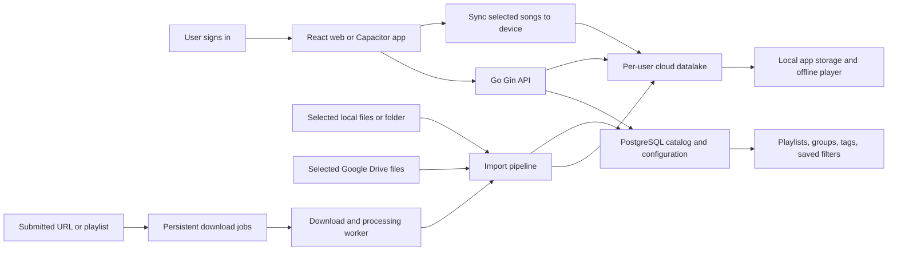

# Song Sleeve implementation plan

**Status:** planning  
**Last updated:** 2026-10-03

## Product direction

Song Sleeve is a personal music library with one canonical cloud library per user and local copies on devices the user chooses to sync. Local folders and Google Drive are import origins. After import, playback and organization use the app's own library; the original source can be disconnected.

Songs live together in one logical collection. Playlists, groups, tags, and saved filters describe how a user wants to see and play that collection. Adding a song to a playlist changes configuration; it never moves the audio into a playlist folder or makes another copy.

## Recommended stack

| Layer | Choice | Responsibility |
| --- | --- | --- |
| Web interface | React, TypeScript, Vite | Library, organization, player, and account screens |
| Mobile app | Capacitor | Packages the React interface and connects it to native mobile capabilities |
| API | Go with Gin | Authentication, catalog operations, imports, synchronization, and playback endpoints |
| Catalog and configuration | PostgreSQL | User library, track metadata, playlists, tags, groups, jobs, and sync state |
| Canonical audio storage | Per-user datalake backed by object storage | Stores each imported audio file once |
| Background work | Go workers; yt-dlp and FFmpeg tools | URL inspection, downloads, audio processing, and import jobs |

PostgreSQL stores records about media, not the large audio bytes. A `media_assets` row refers to an object in the datalake. This preserves one canonical audio copy per imported asset while keeping database backups and queries focused on catalog data.

## System at a glance

## User flows

### Import from a source

1. The user signs in and chooses **Import music**.
2. They select a local source or connect Google Drive.
3. They choose files or a folder and review the items to import.
4. The client uploads the selected audio to the API. The Drive connector reads selected Drive files through Google's API and streams their content to the same import pipeline.
5. The API validates the file, calculates a content hash, extracts technical and embedded metadata, and writes the audio to the user's datalake.
6. PostgreSQL records the track, media asset, source provenance, and import result.
7. The user can organize and play the imported copy. The source can be disconnected without removing that copy.

An import is a copy operation. It does not silently keep a live link to the source or watch the original folder for changes. Provide an explicit re-import or update action if the original changes.

### Organize music

The user creates manual playlists, nested groups, tags, and saved filters. A track is referenced by its stable library ID and can appear in many playlists. Playlist membership and ordering are configuration records; audio remains in its single datalake location.

Smart playlists are saved rules such as “tag is focus, vocals are false, rating is at least four.” Store rules as validated fields and operators, then evaluate them with parameterized database queries.

### Sync to a device and play offline

After login on a new device, the app loads the user's catalog and organization. The user chooses individual songs or playlists to sync. The app downloads complete audio files from the datalake to app-managed local storage, verifies them, and marks them available offline. The player uses the local copy when present, so those songs continue playing without a network connection or access to the import source.

Organization and audio have separate sync behavior: catalog changes are small configuration updates; syncing music transfers audio bytes. Do not show a track as available offline until its complete file has been downloaded and verified.

### Download from a URL

The user submits a supported URL or playlist. The API creates a durable job and returns its ID. A worker inspects the source, downloads entries into temporary staging, processes the audio, and stores completed assets in the same datalake used by local and Drive imports. The job updates progress and reports partial failures. Retrying a job must not duplicate entries that already completed.

## Data model

| Entity | Purpose |
| --- | --- |
| `users` | Account identity and library ownership |
| `sources` | Local or Google Drive origin and import configuration; source credentials are stored securely outside ordinary catalog fields |
| `tracks` | Stable library identity and user-facing metadata |
| `media_assets` | Audio object key, content hash, MIME type, size, codec, duration, and verification state |
| `track_assets` | Relationship between a track and one or more encodings or versions |
| `playlists` | Manual playlist or saved smart-playlist rule |
| `playlist_items` | Ordered membership of tracks in manual playlists |
| `groups` | User-defined hierarchy for organizing playlists and views |
| `tags` and `track_tags` | Reusable labels and their track memberships |
| `import_jobs` | Durable local, Drive, and URL import progress and errors |
| `device_sync` | Per-device sync selections, completed assets, and catalog cursor |
| `change_log` | Ordered catalog changes for incremental sync and recovery |

Use stable IDs rather than filenames or paths as identity. A content hash can find exact duplicate files; different encodings should be suggested as possible matches rather than merged automatically. Preserve metadata provenance so user corrections take priority over later rescans or enrichment.

## Storage, API, and playback behavior

The datalake is a per-user logical namespace in object storage. Objects use stable internal keys, for example `user-id/asset-id/original.ext`; users see one library, not a playlist-shaped folder tree. Object storage is separate from PostgreSQL but the `media_assets` table records the object key and ownership. A provider interface keeps object storage replaceable if hosting needs change.

The Gin API should stream uploads to object storage rather than buffering whole songs in memory. It should support resumable uploads, validate size and media type, compute checksums while streaming, and register the database record only after the object is complete. Failed imports keep recoverable job state and clean up abandoned staging objects.

The player requests audio by track ID. The API checks the user's access, resolves a playable asset, and streams it with correct media headers and byte-range support so seeking does not require downloading a whole song again. The React player owns queue, play/pause, seek, shuffle, and repeat state. Capacitor clients add native playback and media-session integration so audio can continue when the app is backgrounded or the device is locked.

## Google Drive integration and costs

Use the original Google Drive API for Drive imports. Authenticate with OAuth, let the user select files, retrieve Drive metadata and content, and pass the bytes through the common import pipeline into the datalake. Store Drive file IDs and import details as provenance, not as the permanent playback location.

Google's current Drive documentation says standard API use is available at no additional charge, subject to quotas. Google says charges for usage above standard daily thresholds are planned for later in 2026, with notice before changes take effect. Uploading files into the user's Drive consumes that user's Drive storage; importing them into the app's datalake instead consumes the app's object-storage capacity and transfer budget. Hosting PostgreSQL and the API also has separate infrastructure costs. [Drive usage limits and pricing](https://developers.google.com/workspace/drive/api/guides/limits).

Use the narrowest OAuth scopes that support the chosen picker flow. The `drive.file` scope grants access to files the app creates or files the user explicitly opens or shares with it; it is not blanket access to the account's existing Drive. [Drive scope guidance](https://developers.google.com/workspace/drive/api/guides/api-specific-auth). Use resumable transfers and exponential backoff for interrupted uploads or rate limits. [Drive upload guidance](https://developers.google.com/workspace/drive/api/guides/manage-uploads).

## Authentication and security

Require authenticated API access for catalog and media endpoints. Enforce user ownership in every database query and object-storage operation; knowing a track or object ID must not grant access. Keep OAuth refresh tokens encrypted and out of logs. Use short-lived signed upload or download grants where appropriate, validate URL jobs, limit worker resources, and record import and sync failures without logging private file contents.

## Repository and service shape

Keep the first backend as a modular Go application: Gin routes call services for accounts, library, organization, imports, storage, playback, and synchronization. Put PostgreSQL migrations and queries under version control. Keep the React client behind API and platform adapters so browser, desktop, and Capacitor code can call the same application operations while supplying different file-picker and playback implementations.

Deploy the API, PostgreSQL, object storage, and workers as separate operational components. For local development, use a reproducible environment with PostgreSQL and an S3-compatible object store. Production needs TLS, authentication, backups, object lifecycle cleanup, storage quotas, observability, and rate limits.

## Delivery plan

| Phase | Deliverable | Completion condition |
| --- | --- | --- |
| 0. Architecture spike | Gin upload/download stream, PostgreSQL records, object storage, byte-range playback | A representative song uploads, seeks, and plays without whole-file buffering |
| 1. Accounts and catalog | Login, users, tracks, assets, source records, search | A signed-in user sees only their own library |
| 2. Local import | File and folder selection, resumable upload, metadata extraction, duplicate detection | Import survives a network interruption and keeps one canonical copy |
| 3. Organization | Playlists, ordering, groups, tags, saved filters, portable configuration export | One song appears in multiple contexts without duplicating audio |
| 4. Device sync | Device registration, selected playlist/song downloads, local index, offline playback | A synced song plays with network disabled |
| 5. Google Drive import | OAuth, picker, metadata, content transfer, retry behavior | Selected Drive files import and play after Drive is disconnected |
| 6. URL download jobs | Playlist inspection, durable queue, worker, progress, retries | Partial failures can resume without duplicate tracks |
| 7. Capacitor mobile | Native file selection, background playback, lock-screen controls | Playback continues across app backgrounding and device lock |
| 8. Multi-device changes | Incremental catalog sync, change log, conflict handling | Playlist and tag changes converge across devices predictably |

## Key decisions and risks

- **Object storage is the datalake; PostgreSQL is the catalog.** Storing audio bytes in PostgreSQL would make database growth, backups, and restores scale with the full collection. Keep a media-assets table for ownership and object metadata.
- **Imports copy; they do not mirror.** Source changes do not silently overwrite a user's library copy. Add re-import behavior as an explicit feature.
- **Audio sync and configuration sync are different.** Users can sync organization without downloading every song, and can choose which files to cache offline.
- **Mobile playback needs native work.** Capacitor shares much of the UI, while background playback and device media controls need platform integrations.
- **Downloads require policy review.** yt-dlp is a tool, not authorization to download a particular source. YouTube's terms restrict downloading except where authorized; Apple also restricts apps that enable third-party media downloads without explicit authorization. Check source terms and distribution requirements before enabling or publishing that feature. [YouTube terms](https://www.youtube.com/static?template=terms), [Apple App Review guideline 5.2.3](https://developer.apple.com/app-store/review/guidelines/#intellectual-property).

## Initial scope recommendation

Start with login, one local-folder import path, the canonical object-storage datalake, PostgreSQL catalog records, playlist and tag organization, and reliable online playback. Then add device sync and offline playback before Google Drive and URL-download integrations. This validates the core promise—one organized library that can be copied to a new device—before adding more import sources.

## References

- [Gin documentation](https://gin-gonic.com/docs/)
- [Capacitor documentation](https://capacitorjs.com/docs)
- [Google Drive API limits and pricing](https://developers.google.com/workspace/drive/api/guides/limits)
- [Google Drive API scopes](https://developers.google.com/workspace/drive/api/guides/api-specific-auth)
- [Google Drive resumable uploads](https://developers.google.com/workspace/drive/api/guides/manage-uploads)
- [PostgreSQL storage and TOAST](https://www.postgresql.org/docs/current/storage-toast.html)
- [yt-dlp documentation](https://github.com/yt-dlp/yt-dlp)
- [YouTube Terms of Service](https://www.youtube.com/static?template=terms)
- [Apple App Review Guidelines](https://developer.apple.com/app-store/review/guidelines/)
