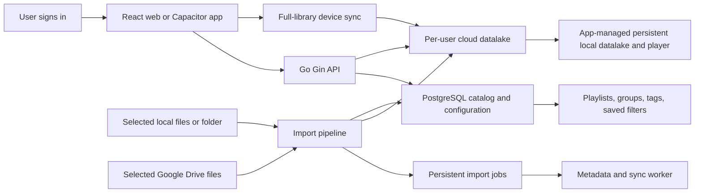

# Song Sleeve implementation plan

**Status:** planning  
**Last updated:** 2026-10-03

## Product direction

Song Sleeve is a personal music library with one canonical cloud library per user and a complete app-managed local library on every device the user syncs. Local folders and Google Drive are import origins only. After import, the cloud copy is canonical; after device sync, playback uses Song Sleeve's private local copy. The original source can be moved, deleted, or disconnected without affecting either app-managed copy.

Songs live together in one logical collection. Playlists, groups, tags, and saved filters describe how a user wants to see and play that collection. Adding a song to a playlist changes configuration; it never moves the audio into a playlist folder or makes another copy.

## Recommended stack

| Layer | Choice | Responsibility |
| --- | --- | --- |
| Web interface | React, TypeScript, Vite | Library, organization, player, and account screens |
| Mobile app | Capacitor | Packages the React interface and connects it to native mobile capabilities |
| API | Go with Gin | Authentication, catalog operations, imports, and device-sync authorization/download grants |
| Catalog and configuration | PostgreSQL on Railway | User library, track metadata, playlists, tags, groups, jobs, and sync state |
| Canonical audio storage | Railway Storage Bucket (S3-compatible object storage) | Stores each imported audio file once, independently of playlist organization |
| Background work | Go workers | Resumable imports, metadata extraction, and sync coordination |
| Web deployment | Vercel | Builds and serves the Vite web client and its preview deployments |
| API, workers, and production data services | Railway | Runs Gin, background workers, PostgreSQL, and the canonical song bucket |

PostgreSQL stores records about media, not the large audio bytes. A `media_assets` row refers to an object in the datalake. This preserves one canonical audio copy per imported asset while keeping database backups and queries focused on catalog data.

## System at a glance

## User flows

### Import from a source

1. The user signs in and chooses **Import music**.
2. They select a local source or connect Google Drive.
3. They choose files or a folder and review the items to import.
4. The selected bytes are copied into Song Sleeve's cloud datalake: local-file uploads go directly to the private bucket using a short-lived upload URL; the Drive import service reads selected Drive files through Google's API and stores them through the same import pipeline.
5. The import pipeline validates the file, calculates a content hash, extracts technical and embedded metadata, and writes one canonical audio object to the user's cloud datalake.
6. PostgreSQL records the track, media asset, source provenance, and import result.
7. The source device's full-library sync downloads the canonical cloud object into Song Sleeve's app-managed persistent local datalake. This is a separate copy from the selected source file, even when that source file is already on the same device. Other devices sync the same canonical object without needing access to the original source.
8. Playback opens the app-managed local copy only. The cloud bucket is used for import and device sync, not as a playback stream. The user can move, delete, or disconnect the origin without removing the cloud or synced app copy.

Import/upload and device sync are separate operations. Import copies the origin's bytes into the canonical cloud library; sync copies ready cloud assets into a device's private local library. The app does not keep a live link to the source or watch the original folder for changes. Provide an explicit re-import or update action if the original changes.

### Organize music

The user creates manual playlists, nested groups, tags, and saved filters. A track is referenced by its stable library ID and can appear in many playlists. Playlist membership and ordering are configuration records; audio remains in its single datalake location.

Smart playlists are saved rules such as “tag is focus, vocals are false, rating is at least four.” Store rules as validated fields and operators, then evaluate them with parameterized database queries.

### Sync the full library to a device and play locally

After login on a new device, the app loads the user's catalog and organization, calculates the total bytes required, then downloads every ready song in the cloud library into Song Sleeve's private persistent local storage. The source of each file is irrelevant: songs imported from Drive and songs originally selected from device storage follow the same sync path. The app always creates its own managed copy, even if the original file still exists on that device. It downloads to a temporary path, checks expected size and checksum, then atomically moves the verified file into the local library. Playback reads only from this local library; it never needs the origin or a live cloud connection once sync completes.

Full-library sync is the device's sync mode. Once enabled, new imports are added to that device's sync queue, and catalog/playlist changes sync as lightweight configuration separately from audio bytes. A device is fully synced only after every ready cloud asset has a verified local copy. Show total and remaining storage, progress, failures, and insufficient-space or network-paused states; never silently skip a song or present an incomplete asset as locally available. The user can pause and resume the transfer, but there is no streaming fallback in this design.

## Data model

| Entity | Purpose |
| --- | --- |
| `users` | Account identity and library ownership |
| `sources` | Local or Google Drive provenance and import configuration only; a local original path is not durable, and source credentials are stored securely outside ordinary catalog fields |
| `tracks` | Stable library identity and user-facing metadata |
| `media_assets` | Audio object key, content hash, MIME type, size, codec, duration, and verification state |
| `track_assets` | Relationship between a track and one or more encodings or versions |
| `playlists` | Manual playlist or saved smart-playlist rule |
| `playlist_items` | Ordered membership of tracks in manual playlists |
| `groups` | User-defined hierarchy for organizing playlists and views |
| `tags` and `track_tags` | Reusable labels and their track memberships |
| `import_jobs` | Durable local and Drive import progress and errors |
| `device_sync` | Per-device full-library sync state, completed asset IDs, retry state, and catalog cursor |
| `local_asset_index` (device-local) | Maps each cloud `media_asset_id` to one app-managed relative file path, checksum, size, and local availability state; never sync absolute OS/source paths between devices |
| `change_log` | Ordered catalog changes for incremental sync and recovery |

Use stable IDs rather than filenames or paths as identity. A content hash can find exact duplicate files; different encodings should be suggested as possible matches rather than merged automatically. Preserve metadata provenance so user corrections take priority over later rescans or enrichment.

## Storage, API, and playback behavior

The datalake is a per-user logical namespace in object storage. Objects use stable internal keys, for example `user-id/asset-id/original.ext`; users see one library, not a playlist-shaped folder tree. Object storage is separate from PostgreSQL but the `media_assets` table records the object key and ownership. A provider interface keeps object storage replaceable if hosting needs change.

For direct client imports, the Gin API authorizes the user, creates a pending media record and opaque object key, then returns a short-lived presigned upload URL. The browser or Capacitor client uploads directly to the private Railway bucket, avoiding whole-song buffering in the API and avoiding Railway service egress for the direct client-to-bucket transfer. Use multipart upload for large files and resumable job state for interrupted imports. On completion, verify object size and checksum before marking the media asset ready; clean up abandoned staging objects.

Do not play audio from the bucket or from the selected source path. The app issues a short-lived presigned `GetObject` URL only to perform a device-sync download. The client writes the complete asset to a temporary file in app-managed persistent storage, verifies size and checksum, then atomically renames it into the local datalake and updates `local_asset_index`. If a URL expires or a transfer is interrupted, the sync worker requests a fresh URL and resumes/restarts safely. Playback resolves a track to its verified local file path. This design intentionally uses additional device storage, and importing from a device then syncing that library back to the same device transfers the bytes twice (source-to-cloud, then cloud-to-app-local); it guarantees the local app copy matches the canonical library copy. Use a persistent app data/library directory, not a cache or temporary directory that the OS may purge. Capacitor's Filesystem plugin distinguishes persistent `Data`/`Library` locations from purgeable `Cache`, and its File Transfer plugin supports downloading to a device path with progress events. [Capacitor Filesystem directory behavior](https://github.com/ionic-team/capacitor-filesystem/blob/main/README.md), [Capacitor File Transfer](https://github.com/ionic-team/capacitor-file-transfer).

The React player owns queue, play/pause, seek, shuffle, and repeat state but receives a local URI from the platform storage adapter. Capacitor clients add native playback and media-session integration so audio can continue when the app is backgrounded or the device is locked. Songs that have not completed full-library sync are not playable until the local download finishes; do not silently switch to remote streaming.

### Railway storage options for song files

Railway offers attached volumes and S3-compatible Storage Buckets. Use a **Storage Bucket** for the canonical song datalake. Buckets are private, support presigned URLs and multipart uploads, and cost $0.015 per GB-month with no bucket API-operation or bucket-egress charge. A 40 TB library is about $600/month for storage alone, before PostgreSQL, API/worker compute, backups, and import-transfer costs. Railway's Hobby plan caps combined bucket capacity at 1 TB; Pro currently has no stated capacity cap. Recheck plan limits and pricing before launch. [Railway Storage Buckets](https://docs.railway.com/storage-buckets), [Bucket billing](https://docs.railway.com/storage-buckets/billing).

Direct client uploads and device downloads are the preferred media path. Bucket egress is free, but data uploaded from a Railway service to a bucket counts as that service's network egress. A Google Drive import performed by a Railway worker therefore has service-transfer cost; measure this separately. Device downloads go directly from the bucket to the client and do not use Railway service egress, though they consume the user's network data and device storage. Railway Buckets are reached over the public network and do not currently use Railway private networking. Configure bucket CORS for the Vercel production domain, any allowed preview domains, and the Capacitor origins. Never expose bucket credentials in Vercel variables or the mobile bundle; only trusted backend services may use them, and only the Gin API issues user-facing presigned URLs. [Railway file upload and delivery patterns](https://docs.railway.com/storage-buckets/uploading-serving), [Railway private networking and egress](https://docs.railway.com/storage-buckets/billing).

An attached Railway Volume is a mounted filesystem, not a horizontally scalable object datalake. It is tied to a service and region, has plan-dependent size limits, and Railway documents that volumes cannot be attached to replicated services. Volumes can be useful for PostgreSQL's data directory, temporary processing, or a small single-instance self-hosted deployment; they are a poor canonical song store for this multi-device app. Do not save songs to a service's ephemeral filesystem because it is lost across deployment/restart lifecycles. [Railway Volumes](https://docs.railway.com/volumes), [Railway volume limits](https://docs.railway.com/volumes/reference).

Railway Buckets currently document no S3 server-side encryption option, object versioning, object locks, or lifecycle configuration support. This does not establish whether Railway encrypts bucket data at rest under its own infrastructure; confirm that directly with Railway before production. Railway's bucket documentation does not describe scheduled bucket snapshots; treat the bucket as production data that needs an independent recovery strategy. Keep PostgreSQL metadata backups separate, and plan periodic object inventory/checksum verification plus a second copy outside the bucket (or another provider) before the library becomes irreplaceable. This adds cost, so include it in the storage budget. Bucket locations currently include California (`sjc`), Virginia (`iad`), Amsterdam (`ams`), and Singapore (`sin`); there is no listed Brazil region, and bucket region cannot be changed after creation. For a Brazil-first audience, benchmark import and full-library sync transfer times from real networks before committing; compare Virginia and California rather than assuming the physically nearest endpoint is fastest. [Railway bucket feature support](https://docs.railway.com/storage-buckets), [Railway bucket regions](https://docs.railway.com/cli/bucket).

#### Provision and configure the bucket

Create a separate bucket in each Railway environment from the project canvas (**+ New → Bucket**) or with the Railway CLI. Select the bucket region deliberately because it cannot be changed later. Current CLI region codes are `sjc`, `iad`, `ams`, and `sin`. In the bucket's **Credentials** tab, use Railway's variable references to inject credentials only into the Gin API and worker services. Map them to application settings such as `S3_ENDPOINT` (`ENDPOINT`), `S3_BUCKET` (`BUCKET`), `S3_REGION` (`REGION`, currently `auto` for S3 signing), `S3_ACCESS_KEY_ID` (`ACCESS_KEY_ID`), and `S3_SECRET_ACCESS_KEY` (`SECRET_ACCESS_KEY`). Use the API bucket name supplied as `BUCKET`, not the display name or `RAILWAY_BUCKET_NAME`. Railway uses virtual-hosted S3 URLs for new buckets; follow the URL style shown in the Credentials tab. [Railway bucket setup and credentials](https://docs.railway.com/storage-buckets), [Railway CLI bucket commands](https://docs.railway.com/cli/bucket).

Use the AWS SDK for Go v2 S3 client behind a small `ObjectStore` interface. Configure its S3 `BaseEndpoint` from `S3_ENDPOINT`, region from `S3_REGION`, credentials from Railway's access-key variables, and virtual-host addressing according to Railway's provided URL style. Keep this provider-specific configuration in one constructor so the same interface can use a local S3-compatible service in development and a different bucket provider later. Do not replace the SDK's S3 endpoint resolver unless a compatibility test proves the default resolver cannot handle the provided endpoint. [AWS SDK for Go v2 custom endpoints](https://docs.aws.amazon.com/sdk-for-go/v2/developer-guide/configure-endpoints.html), [AWS SDK for Go v2 S3 presigned URL examples](https://docs.aws.amazon.com/sdk-for-go/v2/developer-guide/go_s3_code_examples.html).

Configure bucket CORS for the exact web origins that need direct upload or sync download: production Vercel domain, a stable staging/preview domain, and the Capacitor web origin(s). Allow only required methods (`PUT`, `GET`, `HEAD`) and request headers (for example `Content-Type` and the checksum headers actually used); expose response headers the client needs, such as `ETag`. CORS is a browser policy, not authorization: every upload/download URL must still be short-lived and scoped to one server-generated object key. Keep bucket credentials on Railway and never return them to clients. [Railway browser upload and CORS guidance](https://docs.railway.com/guides/storage-buckets-guide).

#### Use the bucket for import, device sync, and cleanup

1. When the user starts an import, authorize ownership and create a pending `media_assets` row and durable import job in PostgreSQL. Generate an opaque unique key under the user's namespace, such as `users/{userID}/assets/{assetID}/original`, never from a raw filename. Return a short-lived presigned `PutObject` URL (or multipart-upload instructions for large files) for that one key. The client uploads the bytes directly and reports completion; it never receives the bucket's permanent credentials.
2. On completion, the API or worker performs `HeadObject` to confirm the object exists and its expected size and content type. Store the checksum reported/calculated by the client as an expected value, and have a trusted worker verify the object bytes before marking the asset ready when stronger integrity guarantees are required. Do not treat multipart ETags as SHA-256 checksums. Keep incomplete jobs retryable; delete failed staging objects and abandon incomplete multipart uploads through a scheduled cleanup job because bucket lifecycle rules are not currently supported.
3. For device sync, resolve each asset ID through PostgreSQL, enforce user ownership, then return a short-lived presigned `GetObject` URL for its ready cloud object. Download the complete file to a temporary app-private path, verify it, and atomically place it in the local library. Refresh the URL on expiry and retry interrupted downloads. Playback uses only the verified local file, not the object URL.
4. Store only the opaque key and media metadata in PostgreSQL. On delete, mark the DB asset as deleting, delete the object through the storage adapter, then finalize the DB row; retry failed deletes from a job queue. Schedule an object inventory reconciliation that finds abandoned or unreferenced keys and checks for DB rows whose object is missing. Keep a second copy in a separate provider or account before users rely on the cloud library as their only copy.

## Google Drive integration and costs

Use the original Google Drive API for Drive imports. Authenticate with OAuth, let the user select files, retrieve Drive metadata and content, and pass the bytes through the common import pipeline into the datalake. Store Drive file IDs and import details as provenance, not as the permanent playback location.

Google's current Drive documentation says standard API use is available at no additional charge, subject to quotas. Google says charges for usage above standard daily thresholds are planned for later in 2026, with notice before changes take effect. Uploading files into the user's Drive consumes that user's Drive storage; importing them into the app's datalake instead consumes the app's object-storage capacity and transfer budget. Hosting PostgreSQL and the API also has separate infrastructure costs. [Drive usage limits and pricing](https://developers.google.com/workspace/drive/api/guides/limits).

Use the narrowest OAuth scopes that support the chosen picker flow. The `drive.file` scope grants access to files the app creates or files the user explicitly opens or shares with it; it is not blanket access to the account's existing Drive. [Drive scope guidance](https://developers.google.com/workspace/drive/api/guides/api-specific-auth). Use resumable transfers and exponential backoff for interrupted uploads or rate limits. [Drive upload guidance](https://developers.google.com/workspace/drive/api/guides/manage-uploads).

## Authentication and security

Require authenticated API access for catalog and media endpoints. Enforce user ownership in every database query and object-storage operation; knowing a track or object ID must not grant access. Keep OAuth refresh tokens encrypted and out of logs. Use short-lived signed upload or download grants where appropriate, limit worker resources, and record import and sync failures without logging private file contents.

## Repository and service shape

Keep the first backend as a modular Go application: Gin routes call services for accounts, library, organization, imports, storage, playback, and synchronization. Put PostgreSQL migrations and queries under version control. Keep the React client behind API and platform adapters so browser, desktop, and Capacitor code can call the same application operations while supplying different file-picker and playback implementations.

Deploy the React/Vite web client to Vercel. Deploy the Gin API and separate Go worker service(s), PostgreSQL, and Railway Storage Bucket in Railway. Keep API, database, worker, and bucket in the same supported region where available. Put credentials and OAuth secrets in Railway's encrypted service variables; expose only the public API base URL and non-secret feature flags as Vercel `VITE_*` build variables. Vite embeds these values in the browser bundle, so they are public. Do not place database URLs, bucket keys, signing secrets, or Google OAuth client secrets in Vercel's browser-visible `VITE_*` values.

For local development, use PostgreSQL and an S3-compatible object store with the same adapter/configuration shape as Railway Buckets. Production needs TLS, authentication, backup and restore drills, object integrity checks, quotas, observability, and rate limits.

### Deployment instructions

1. Create separate Railway environments for staging and production. In each environment, create a PostgreSQL service and a Railway Storage Bucket; keep their region aligned with the API/workers. Bucket instances and credentials are isolated per Railway environment, but their stored capacity is billed together across the workspace. The bucket region is fixed at creation, so choose it before importing real files.
2. Deploy the Gin API as a Railway service from the backend directory or its Dockerfile. Bind to `0.0.0.0:$PORT`, expose `/health` returning 2xx when ready, configure Railway's healthcheck, and add a Railway domain or custom API domain. Keep PostgreSQL private and use Railway's internal `DATABASE_URL` reference.
3. Deploy the Go worker as a separate service from the same repository/image with a worker start command. Give it database and bucket permissions but no public web domain. Scale worker concurrency independently; do not run schema migrations concurrently from every API replica. Run migrations as a controlled pre-deploy/release step.
4. Configure API and worker variables from Railway's references: PostgreSQL URL, S3 endpoint, bucket name, access key, secret key, region, allowed client origins, Google OAuth server secrets, and signing configuration. Do not duplicate storage credentials into Vercel.
5. Connect the repository to Vercel and set the web app's root directory (for example, `apps/web` in a future monorepo), framework preset Vite, install command, build command (`npm run build`), and output directory (`dist`). Vercel creates preview deployments for branches and production deployments for the configured production branch. Configure `VITE_API_BASE_URL` separately for local, preview/staging, and production. Enable SPA route fallback if client-side routes need it.
6. Configure Gin CORS for the exact Vercel production domain, intended Vercel preview domains, and Capacitor web origins. Permit only required methods and headers; allow credentials only if the chosen cookie-based auth design requires them. Configure bucket CORS separately for the exact browser origins and the required PUT/GET/HEAD methods and headers. Presigned URL usage does not make a private bucket public; it is a bearer capability, so keep expiry short.
7. Build the native iOS/Android packages from the same React app with Capacitor and the platform toolchains. Set the production API base URL in the native build configuration. Native Capacitor requests do not use browser CORS in the same way, but origin allowlists and secure storage of login tokens still need platform-specific handling. Vercel hosts the web client; it does not host the native binary or Railway API.
8. Before release, test staging end to end: local-origin and Google Drive-origin imports, complete full-library downloads including on the device that supplied local originals, checksum validation, retry/resume, insufficient-space behavior, playback from app-private files with network disabled and origins disconnected, token expiry/refresh, CORS, and restore from database backups plus the independent object-copy plan. Observe worker transfer egress as well as bucket storage.

Vercel documents Vite deployments and branch preview URLs; Railway documents private S3-compatible buckets, environment-specific bucket instances, `PORT`-based service healthchecks, and PostgreSQL private connectivity. [Vercel Vite deployment](https://vercel.com/docs/frameworks/frontend/vite), [Vercel deployment environments](https://vercel.com/docs/deployments/environments), [Railway deployments and healthchecks](https://docs.railway.com/deployments/healthchecks), [Railway PostgreSQL](https://docs.railway.com/databases/postgresql).

## Delivery plan

| Phase | Deliverable | Completion condition |
| --- | --- | --- |
| 0. Architecture spike | Gin upload, PostgreSQL records, Railway bucket, app-private download, checksum verification, local playback | A representative song is imported to cloud, fully synced to app storage, and plays with network disabled |
| 1. Accounts and catalog | Login, users, tracks, assets, source records, search | A signed-in user sees only their own library |
| 2. Local import | File and folder selection, resumable upload, metadata extraction, duplicate detection | Import survives a network interruption and keeps one canonical copy |
| 3. Organization | Playlists, ordering, groups, tags, saved filters, portable configuration export | One song appears in multiple contexts without duplicating audio |
| 4. Full-library device sync | Device registration, complete cloud library manifest, app-local data storage, progress/retry/space handling, offline playback | Every ready cloud asset on a device has one verified app-local copy and plays with network disabled |
| 5. Google Drive import | OAuth, picker, metadata, cloud import, full-device sync and retry behavior | Selected Drive files import, sync to app-local storage, and play after Drive is disconnected |
| 6. Capacitor mobile | Native file selection, background playback, lock-screen controls | Playback continues across app backgrounding and device lock |
| 7. Multi-device changes | Incremental catalog sync, change log, conflict handling | Playlist and tag changes converge across devices predictably |

## Key decisions and risks

- **Object storage is the datalake; PostgreSQL is the catalog.** Storing audio bytes in PostgreSQL would make database growth, backups, and restores scale with the full collection. Keep a media-assets table for ownership and object metadata.
- **Imports copy; they do not mirror.** Source changes do not silently overwrite a user's library copy. Add re-import behavior as an explicit feature.
- **Import and sync are separate copies with separate jobs.** Import copies the source into the canonical cloud datalake. Full-library device sync copies every ready cloud asset into app-managed persistent storage, regardless of where it originated. Do not reuse source paths as local library paths, and do not treat a cloud object as a playable track.
- **Mobile playback needs native work.** Capacitor shares much of the UI, while background playback and device media controls need platform integrations.
- **Railway Buckets avoid per-request and bucket-egress charges, but do not eliminate all transfer cost.** A worker that imports Google Drive files incurs Railway service egress; device downloads from the bucket do not count as Railway service egress, though they use the user's network and device storage. Region choice, backup strategy, and object versioning limitations need an explicit decision before importing a large library.

## Initial scope recommendation

Start with login, one local-folder import path, the canonical cloud object datalake, PostgreSQL catalog records, playlist and tag organization, and a full download into app-managed local storage for playback. Then add robust multi-device sync and Google Drive import. Validate that a song can be imported, synced into the app's local datalake, and played with network access disabled before expanding import origins.

## References

- [Gin documentation](https://gin-gonic.com/docs/)
- [Capacitor documentation](https://capacitorjs.com/docs)
- [Google Drive API limits and pricing](https://developers.google.com/workspace/drive/api/guides/limits)
- [Google Drive API scopes](https://developers.google.com/workspace/drive/api/guides/api-specific-auth)
- [Google Drive resumable uploads](https://developers.google.com/workspace/drive/api/guides/manage-uploads)
- [PostgreSQL storage and TOAST](https://www.postgresql.org/docs/current/storage-toast.html)
- [Vercel Vite deployment](https://vercel.com/docs/frameworks/frontend/vite)
- [Vercel deployment environments](https://vercel.com/docs/deployments/environments)
- [Railway Storage Buckets](https://docs.railway.com/storage-buckets)
- [Railway bucket billing](https://docs.railway.com/storage-buckets/billing)
- [Railway file upload and serving](https://docs.railway.com/storage-buckets/uploading-serving)
- [Railway browser uploads and CORS](https://docs.railway.com/guides/storage-buckets-guide)
- [Railway bucket CLI, credentials, and regions](https://docs.railway.com/cli/bucket)
- [Railway regions](https://docs.railway.com/deployments/regions)
- [Railway Volumes](https://docs.railway.com/volumes)
- [Railway volume limits](https://docs.railway.com/volumes/reference)
- [Railway PostgreSQL](https://docs.railway.com/databases/postgresql)
- [Railway healthchecks](https://docs.railway.com/deployments/healthchecks)
- [AWS SDK for Go v2 custom endpoints](https://docs.aws.amazon.com/sdk-for-go/v2/developer-guide/configure-endpoints.html)
- [AWS SDK for Go v2 S3 presigned URL examples](https://docs.aws.amazon.com/sdk-for-go/v2/developer-guide/go_s3_code_examples.html)
- [Capacitor Filesystem directory behavior](https://github.com/ionic-team/capacitor-filesystem/blob/main/README.md)
- [Capacitor File Transfer](https://github.com/ionic-team/capacitor-file-transfer)
