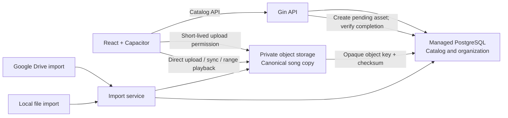

# Database and song storage research

**Status:** research  
**Last updated:** 2026-10-03  
**Scope:** compare database and audio-storage choices for Song Sleeve without changing the existing implementation plan.

## Recommendation

Keep **PostgreSQL for the catalog and organization**, and store audio bytes in a separate **object storage service**. The application has relational data—users, tracks, playlist membership, tags, groups, and sync state—while the songs are large immutable objects. Treating those as separate workloads lets each scale and be billed independently.

PostgreSQL is still a good fit. The potentially expensive part is the growing media library and the bandwidth used to stream and sync it, not the playlist rows. Putting music bytes in PostgreSQL would make database disk, backups, replication, and restores grow with every song.

For an initial cloud deployment, test a managed PostgreSQL service in the region closest to the first users, plus an object store with predictable download costs. If the first audience is in Brazil, Neon, Supabase, and AWS document PostgreSQL deployments in São Paulo; compare actual connection paths before choosing a provider. [Neon regional latency dashboard](https://neon.com/demos/regional-latency), [Supabase regions](https://supabase.com/docs/guides/platform/regions), [AWS RDS PostgreSQL regions](https://docs.aws.amazon.com/AmazonRDS/latest/UserGuide/Concepts.RDS_Fea_Regions_DB-eng.Feature.MultiAZDBClusters.html).

## What needs to scale

| Workload | Shape | Main scaling cost |
| --- | --- | --- |
| Catalog and organization | Small rows, relational queries, many users | Database CPU, memory, disk, connections, backups |
| Audio datalake | Large files, mostly write once and read many times | Stored GB-months, redundancy, object requests |
| Streaming and sync | Repeated reads of complete songs or byte ranges | Network egress, CDN delivery, GET requests |
| Import pipeline | Large uploads, metadata inspection, source transfer | Worker time, temporary space, upload retries |
| Mobile offline library | Selected files copied to each device | Device storage and one-time sync transfer |

Keep these costs separate in metrics. A library with millions of tracks can still have a modest relational catalog, while audio playback can move many gigabytes even when the database is nearly idle.

## Database options

| Option | Fit for Song Sleeve | Resource and scale profile | Assessment |
| --- | --- | --- | --- |
| PostgreSQL | Strong fit for users, playlists, tags, groups, filters, and sync records | Start with one managed primary; scale compute and disk, then add read replicas or partitioning when measurements justify it | Recommended database engine |
| Managed serverless PostgreSQL, such as Neon | Same PostgreSQL model with usage-based compute, autoscaling, and scale-to-zero | Can reduce idle compute cost; resuming after idle adds startup latency, and active connections prevent idling | Strong early-stage hosting candidate if connection pooling and wake behavior are acceptable |
| Supabase Postgres | Same PostgreSQL engine with integrated auth, storage, APIs, and realtime features | Predictable paid-plan floor and included usage; additional compute and bandwidth are billed separately | Convenient bundle, but much of the platform overlaps with a Gin API |
| AWS RDS for PostgreSQL | Standard managed PostgreSQL with AWS regional deployment choices | Always provisioned compute gives a predictable baseline; Multi-AZ and replicas add resilience and cost | Good when AWS operations and São Paulo locality are priorities |
| MySQL | Can support the core relational model | Similar operational footprint and scaling approach to PostgreSQL | Technically viable, but no clear cost or resource advantage for this schema |
| MongoDB | Flexible documents for user settings or denormalized views | Can scale document reads and writes, but overlapping playlists, tags, groups, and smart filters require more duplicated data or application joins | No compelling reason to choose it for the source-of-truth catalog |
| DynamoDB | Strong key-based access at high scale | Usage-based and horizontally scalable, but each new query shape needs planned keys and indexes | Consider only if measured access patterns become stable and key-centric |
| Cloudflare D1 / SQLite database service | Useful for small edge or local data | D1 currently limits a database to 10 GB on paid plans and an individual BLOB or row to 2 MB | Not suitable for the primary catalog plus songs; local SQLite remains useful on each device |

PostgreSQL supports the access pattern directly: a user has many tracks; playlists and tracks have a many-to-many relationship; each track may have tags and several media versions; smart playlists filter and sort combinations of those fields. That flexibility matters more here than raw key-value throughput.

**Neon** and **Supabase** are PostgreSQL hosting choices, not replacements for the PostgreSQL data model. Neon documents compute that can scale to zero after five minutes idle, with a small wake-up delay; this works best when the application uses a pool and does not hold an always-on database connection. [Neon compute lifecycle](https://neon.com/docs/manage/endpoints/), [Neon usage-based billing](https://neon.com/blog/new-usage-based-pricing). Supabase has a São Paulo region, but each project includes its own Postgres compute and the paid plan includes a fixed bundle of compute, database, and bandwidth. [Supabase regions](https://supabase.com/docs/guides/platform/regions), [Supabase pricing](https://supabase.com/pricing), [Supabase compute billing](https://supabase.com/docs/guides/platform/billing-on-supabase).

Cloudflare D1 is not a general-purpose Postgres alternative for this app. Its current documented paid limit is 10 GB per database, and the maximum BLOB or row is 2 MB—too small for many songs. [D1 limits](https://developers.cloudflare.com/d1/platform/limits/).

## Song storage options

| Option | Current pricing shape | Advantages | Trade-offs |
| --- | --- | --- | --- |
| Cloudflare R2 Standard | $0.015 per GB-month; $4.50 per million Class A writes; $0.36 per million Class B reads; no internet egress charge | Predictable cost when users stream or sync a lot; S3-compatible API | Regional placement is best-effort with broad location hints; no South America location hint is listed, so test latency from the target market |
| Backblaze B2 | Starts at $6.95 per TB-month; free egress up to 3× average monthly storage, then $0.01 per GB; transaction pricing depends on API call class | Low stated storage rate; egress allowance can suit moderate playback volume | Region affects rates and latency; egress above the allowance or delivery outside qualifying partners adds cost |
| Wasabi Hot Cloud Storage | Starts at $7.99 per TB-month with no egress or API-request fee | Simple capacity-based price for a stable, frequently read collection | Pay-as-you-go has a 1 TB minimum and a 90-day minimum storage duration, which can penalize small libraries and frequent deletes |
| Amazon S3 Standard | Region-specific storage, requests, retrieval, and transfer charges | Mature ecosystem, lifecycle tools, strong AWS integration, São Paulo region | Internet egress is billable after included allowances; more billing dimensions to monitor |
| Supabase Storage | Bundled with Supabase project quotas and usage pricing | Simplifies auth, database, object storage, and access controls in one platform | Less attractive if Gin already owns auth and business logic; egress and storage are still metered |
| Local filesystem or attached disk | Disk purchase or compute-provider volume price | Simple for development or a personal single-server installation | A single disk is not a managed datalake; replication, backups, expansion, and failure recovery become your responsibility |
| PostgreSQL `BYTEA` or large objects | Billed as database storage, compute, backups, and database transfer | One database backup format and transaction boundary | Couples song volume to database scaling, backup duration, restore time, and replication traffic; avoid for the canonical library |

Provider prices are snapshots from public pricing pages and can vary by region, currency, tax, and account terms. R2 lists storage, operation, and retrieval prices and explicitly charges no egress. [R2 pricing](https://developers.cloudflare.com/r2/pricing/). Backblaze lists its base storage rate and 3× egress allowance, while noting that regional and workload assumptions affect comparisons. [Backblaze B2 pricing](https://www.backblaze.com/cloud-storage/pricing). Wasabi's FAQ documents the 1 TB minimum and 90-day deletion rule for its pay-as-you-go plan. [Wasabi pricing FAQ](https://wasabi.com/pricing/faq). AWS states that S3 costs include storage, requests, retrieval, transfer, and optional management features. [Amazon S3 pricing](https://aws.amazon.com/s3/pricing/).

## Illustrative storage-only estimate

Use **40 TB of stored audio** as a scale example, not a forecast. It could represent 10,000 users with about 1,000 songs each, if each average song is around 4 MB. At current headline rates, the storage-only arithmetic is roughly:

| Provider | Approximate monthly storage charge for 40 TB | Not included |
| --- | ---: | --- |
| Cloudflare R2 Standard | $600 | Class A/B requests; free egress |
| Backblaze B2 | $278 | Region-specific pricing; egress beyond 3× average storage |
| Wasabi | $320 | Regional differences; 1 TB minimum and deletion-duration charges |
| Amazon S3 Standard | Use the regional calculator | Requests and internet egress |

This comparison excludes taxes, API requests, backups or replicas, CDN services, and currency conversion. The rates are not an apples-to-apples guarantee: providers calculate capacity and egress differently, and the quoted B2 and Wasabi figures are starting rates. At this scale, **how many times users stream and sync songs can matter as much as the stored capacity**. One full 4 GB library sync is 4 GB of outbound traffic per new device.

The rough size assumption is easy to replace with actual measurements: export total bytes and distinct files from the current collection, then estimate average stored GB per user, new-user sync GB, and monthly streamed GB. Keep egress per active user and egress-to-storage ratio in the cost dashboard.

## Recommended design

Keep PostgreSQL records small and relational. A `media_assets` row should contain an opaque object key, tenant/user ID, byte size, content type, checksum, encoding details, and state. A `tracks` row points to one or more assets. Playlist and tag relations point to track IDs. Do not store the object itself in the row.

For uploads, the API authenticates the user and creates a pending media record. It issues a short-lived upload grant so the client can send the audio directly to object storage, including multipart upload for large files. On completion, the API verifies object size and checksum, then marks the media asset ready. A cleanup job removes abandoned staging objects and pending records.

For playback and device sync, the API authorizes the user and grants short-lived access to the object, or proxies the stream if finer control is required. Direct object delivery keeps audio bandwidth off the Gin server. Ensure the player can renew access between tracks and use byte-range requests for seeking. Mobile sync writes to a temporary local file, verifies the checksum, and then atomically marks the song available offline.

Object keys should be opaque and private. Keep the bucket non-public, enforce per-user authorization before granting access, use TLS and encryption at rest, and avoid placing emails or track titles in keys. Initial deduplication should be per user. Cross-user deduplication could save storage but reveals whether another user already has a given file unless designed carefully.

Keep the API, database, workers, and storage in a nearby region where possible. For Brazil, São Paulo is an available region for Supabase Postgres and AWS RDS PostgreSQL. R2's current region hints are broad and best-effort rather than a guaranteed São Paulo placement; Cloudflare documents global delivery and free egress, so benchmark upload and first-byte playback latency from the intended user locations before choosing it. [R2 data location](https://developers.cloudflare.com/r2/reference/data-location/), [R2 overview](https://developers.cloudflare.com/r2/how-r2-works/).

## Scaling without overbuilding

Start with one PostgreSQL primary and object storage. Use tenant-aware indexes such as `(user_id, updated_at)` and `(playlist_id, position)`, keyset pagination, and a connection pool. Keep full audio out of database backups. Measure before adding replicas, partitioning, a cache, or a distributed SQL system.

Add capacity where the measurements point:

- Database CPU or slow catalog queries: inspect query plans and indexes, then increase compute; consider a read replica if reads dominate.
- Database disk or backups: check for accidental binary data, excessive history, and index growth. The audio belongs in object storage.
- High object-store egress: compare an egress-free service, CDN caching, and playback patterns. Avoid caching private objects across users unless cache keys enforce authorization.
- Slow imports: increase worker concurrency within provider rate limits; uploads and metadata extraction need not run inside API requests.
- Slow first play or seeking: test the storage region, byte-range handling, object GET latency, and CDN behavior from real mobile networks.

Do not choose a distributed SQL database, a database-per-user topology, or cross-user content deduplication just to prepare for scale. They add operational and privacy complexity before the workload proves a need.

## Decision summary

1. Keep PostgreSQL as the source of truth for catalog and organization.
2. Use a managed PostgreSQL service close to the first user population. Compare Neon for low-idle, autoscaling compute; Supabase for an integrated platform; and AWS RDS for an AWS-native deployment in São Paulo.
3. Keep audio in private object storage behind an adapter. Pilot R2 and B2 against real upload, streaming, and device-sync traffic; include S3 Standard if same-region AWS placement matters more than bandwidth predictability.
4. Select a hot storage class for the main library. Move files to an archive tier only after the user explicitly treats them as archival and accepts slower or billable retrieval.
5. Track media GB, upload GB, streaming GB, sync GB, object reads, database compute, and backup GB separately. Revisit provider choice when measured costs show which dimension dominates.

## Sources

- [Neon compute and scale-to-zero](https://neon.com/docs/manage/endpoints/)
- [Neon usage-based pricing](https://neon.com/blog/new-usage-based-pricing)
- [Neon regional latency dashboard](https://neon.com/demos/regional-latency)
- [Supabase regions](https://supabase.com/docs/guides/platform/regions)
- [Supabase pricing](https://supabase.com/pricing)
- [AWS RDS PostgreSQL regions](https://docs.aws.amazon.com/AmazonRDS/latest/UserGuide/Concepts.RDS_Fea_Regions_DB-eng.Feature.MultiAZDBClusters.html)
- [Cloudflare D1 limits](https://developers.cloudflare.com/d1/platform/limits/)
- [Cloudflare R2 pricing](https://developers.cloudflare.com/r2/pricing/)
- [Cloudflare R2 data location](https://developers.cloudflare.com/r2/reference/data-location/)
- [Backblaze B2 pricing](https://www.backblaze.com/cloud-storage/pricing)
- [Wasabi pay-as-you-go pricing FAQ](https://wasabi.com/pricing/faq)
- [Amazon S3 pricing](https://aws.amazon.com/s3/pricing/)
- [PostgreSQL TOAST storage](https://www.postgresql.org/docs/current/storage-toast.html)
- [PostgreSQL large objects](https://www.postgresql.org/docs/current/lo-intro.html)
